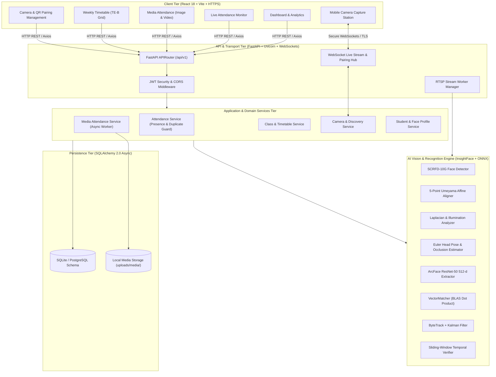
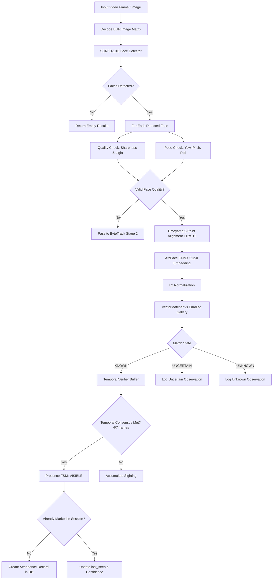
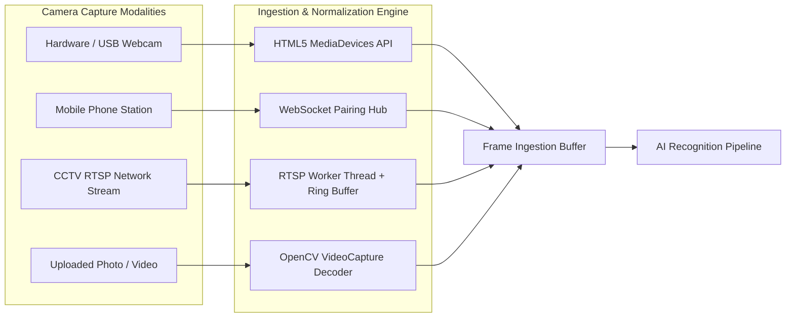
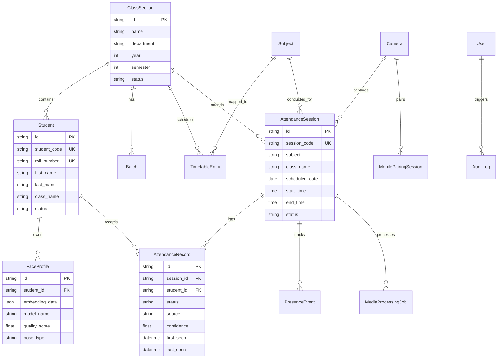

# JOJIPA-SAMS
## Smart Attendance Management System — Technical Project Report

**Document Version:** 1.0.0  
**Project Authority:** Department of Computer Engineering  
**System Name:** JOJIPA-SAMS (Smart Attendance Management System)  
**Target Class:** TE-B (Effective From: 15/06/2026)  
**Date of Report:** August 31, 2026  

---

## Executive Summary & Technology Matrix

| Layer | Technology | Purpose | Actual Usage & Implementation |
| :--- | :--- | :--- | :--- |
| **Frontend Framework** | React 18.3.1 + TypeScript 5.6.3 | Interactive Single Page Application (SPA) | `frontend/src/App.tsx` |
| **Frontend Build Tool** | Vite 5.4.8 + `@vitejs/plugin-basic-ssl` | Fast HMR dev server & HTTPS tunnel for camera permissions | `frontend/vite.config.ts` |
| **CSS Framework** | Tailwind CSS 3.4.13 + Lucide React 0.453.0 | Modern responsive utility layout and icon kit | `frontend/src/index.css` |
| **Backend Framework** | FastAPI 0.115.0+ (ASGI) + Uvicorn 0.30.0+ | High-throughput asynchronous REST & WebSocket API | `backend/app/main.py` |
| **Database Engine** | SQLite 3 (Dev/Local) / PostgreSQL 16+ (Prod) | Relational persistence with JSON & UUID types | `backend/app/database/session.py` |
| **ORM / Data Access** | SQLAlchemy 2.0.30+ (AsyncIO) + Alembic 1.13.0+ | Async ORM, declarative entities, schema migrations | `backend/app/models/entities.py` |
| **Face Detection** | SCRFD-10G (InsightFace `buffalo_l`) | Multi-face detection with 5 fiducial landmarks | `ai_engine/detection/scrfd.py` |
| **Face Recognition** | ArcFace (ResNet-50 / `w600k_r50.onnx`) | 512-dimensional $L_2$-normalized embedding extraction | `ai_engine/recognition/arcface.py` |
| **Vector Matching** | VectorMatcher (BLAS Matrix Dot Product) | Cosine similarity comparison with 3-state decision logic | `ai_engine/recognition/vector_matcher.py` |
| **Face Tracking** | ByteTrack + KalmanBoxTracker | Multi-object tracking across sequential video frames | `ai_engine/tracking/byte_tracker.py` |
| **Temporal Verification**| Sliding-Window Consensus Accumulator | Multi-frame consensus voting and track stabilization | `ai_engine/verification/temporal_verifier.py` |
| **Liveness / Anti-Spoof**| Frequency & Texture Gradient Analysis | Texture analysis and inter-ocular geometry checks | `ai_engine/liveness/liveness_detector.py` |
| **Image Processing** | OpenCV 4.10.0+ (C++ bindings) + NumPy 1.26.0+ | Frame decoding, affine warping, color conversion | `ai_engine/alignment/face_aligner.py` |
| **Camera Protocols** | HTML5 MediaDevices, WebSocket MJPEG, RTSP/TCP | Webcams, Mobile phone pairing, IP CCTV feeds | `backend/app/services/camera_service.py` |
| **Testing Suite** | Pytest 8.2.0+ & Pytest-AsyncIO 0.23.0+ | Asynchronous unit, integration, and E2E testing (100 Tests) | `tests/` |

---

## 1. Abstract

**JOJIPA-SAMS (Smart Attendance Management System)** is an automated, edge-capable biometric attendance platform engineered for collegiate and institutional classroom environments. Traditional roll-call and manual swipe-card mechanisms suffer from substantial instruction time loss (5–10 minutes per lecture), susceptibility to proxy attendance, and a lack of continuous in-lecture presence auditing. 

JOJIPA-SAMS addresses these shortcomings by integrating state-of-the-art computer vision models—including **SCRFD-10G** for face detection, **ArcFace ResNet-50** for 512-dimensional face recognition embeddings, **ByteTrack Kalman tracking** for temporal track persistence, and a **Sliding-Window Temporal Verifier**—to deliver automated, sub-second attendance marking. The system supports diverse visual capture modalities: local USB/hardware webcams, secure QR-paired mobile phones acting as mobile capture stations, IP CCTV RTSP streams, and pre-recorded classroom media (high-resolution group photos and video recordings). 

Built on an asynchronous Python (FastAPI/SQLAlchemy) backend and a React/TypeScript frontend, JOJIPA-SAMS enforces strict **3-Level Duplicate Protection** (`UNIQUE(session_id, student_id)`), real-time presence auditing (`VISIBLE`, `TEMPORARILY_NOT_VISIBLE`, `RETURNED`), official weekly timetable scheduling with batch-level partitioning (e.g. TE-B Batches B1 and B2), and detailed academic attendance reporting.

---

## 2. Introduction & Problem Statement

### 2.1 Background
Classroom management in higher education requires accurate attendance accounting for academic compliance, continuous internal assessment, and regulatory auditing. In standard university setups with 60–80 students per division, manual attendance logging presents critical operational friction:
1. **Instructional Time Degradation:** Calling roll-call or passing physical sign-in sheets consumes 10% to 15% of scheduled lecture time.
2. **Proxy Attendance Vulnerability:** RFID cards, paper sign-ins, and standard barcode scans are easily passed between peers.
3. **Absence of Temporal Verification:** Traditional sign-in mechanisms record a single binary check-in event at the start of class, failing to verify whether a student remained present throughout the academic period.
4. **Hardware Rigidity:** Most commercial facial recognition systems require proprietary, expensive wall-mounted hardware and cannot leverage existing classroom infrastructure (laptops, mobile phones, or RTSP cameras).

### 2.2 Project Objectives
JOJIPA-SAMS is designed to solve these challenges through the following concrete engineering objectives:
- **Zero-Friction Biometric Identification:** Rapid multi-face detection and recognition from live video feeds and uploaded classroom media.
- **Universal Multi-Source Ingestion:** Seamless capture across Hardware Webcams, Mobile Stations (via QR pairing and WebSocket streaming), Network RTSP/CCTV cameras, and Uploaded Media files.
- **Academic Timetable Synchronization:** Direct binding of attendance sessions to real collegiate timetables, subjects, and batch allocations (TE-B Computer Engineering).
- **Audit Traceability & State Tracking:** Continuous presence auditing distinguishing between momentary occlusion and true classroom departure.
- **Strict Data Integrity:** Enforcement of the single attendance record rule per student per session.

---

## 3. System Architecture & High-Level Design

JOJIPA-SAMS employs a decoupled, asynchronous micro-modular architecture divided into four primary tiers: Client Layer, API Gateway Layer, AI Inference Engine, and Persistence/Database Layer.



---

## 4. Technology & Dependency Inventory

### 4.1 Backend Environment & Packages
*Extracted directly from `pyproject.toml` and `requirements.txt`:*

| Package / Module | Version Range | Purpose & Architectural Responsibility | Implementation Location |
| :--- | :--- | :--- | :--- |
| **Python** | 3.10 – 3.14.6 | Core runtime environment | Entire Backend |
| **fastapi** | `>=0.115.0` | Asynchronous ASGI Web Framework, routing, OpenAPI specs | `backend/app/main.py` |
| **uvicorn[standard]** | `>=0.30.0` | High-performance ASGI production server | `start.sh` |
| **sqlalchemy** | `>=2.0.30` | Asynchronous ORM and SQL Expression Engine | `backend/app/database/base.py` |
| **aiosqlite** | `>=0.20.0` | Non-blocking async SQLite driver for local database | `backend/app/database/session.py` |
| **asyncpg** | `>=0.29.0` | High-speed async PostgreSQL driver for production deployment | `backend/app/database/session.py` |
| **alembic** | `>=1.13.0` | Relational database schema migrations | `backend/alembic/` |
| **pydantic** | `>=2.8.0` | Data modeling, request/response validation, settings | `backend/app/schemas/` |
| **insightface** | `>=0.7.3` | Deep face analysis, SCRFD detection, landmark models | `ai_engine/detection/scrfd.py` |
| **onnxruntime** | `>=1.18.0` | High-throughput ONNX model graph execution (CPU/CUDA) | `ai_engine/recognition/arcface.py` |
| **opencv-python** | `>=4.10.0` | Computer vision primitives, image/video decoding, drawing | `ai_engine/alignment/face_aligner.py` |
| **numpy** | `>=1.26.0` | Vectorized matrix transformations and mathematical ops | `ai_engine/recognition/vector_matcher.py` |
| **scipy** | `>=1.12.0` | Hungarian Linear Sum Assignment for bounding box tracking | `ai_engine/tracking/byte_tracker.py` |
| **scikit-learn** | `>=1.4.0` | Distance computations and statistical quality evaluation | `ai_engine/liveness/texture_checker.py` |
| **pyjwt** | `>=2.8.0` | JSON Web Token encoding and signature verification | `backend/app/core/security.py` |
| **bcrypt** | `>=4.1.0` | Salted SHA-256 password hashing for administrative auth | `backend/app/core/security.py` |
| **pytest** | `>=8.2.0` | Automated test runner | `tests/` |

### 4.2 Frontend Packages & Libraries
*Extracted directly from `frontend/package.json`:*

| Library | Version | Purpose & Usage |
| :--- | :--- | :--- |
| **react** / **react-dom** | `18.3.1` | Core declarative component UI library |
| **typescript** | `5.6.3` | Static typing, interface definitions, compiler |
| **vite** | `5.4.8` | Next-generation frontend bundler and dev server |
| **@vitejs/plugin-basic-ssl** | `2.3.0` | Development HTTPS generator (required for WebRTC / mobile camera permissions) |
| **tailwindcss** | `3.4.13` | Utility-first styling framework |
| **lucide-react** | `0.453.0` | SVG iconography across all system views |
| **axios** | `1.7.7` | HTTP REST client with interceptors |
| **qrcode** | `1.5.4` | Canvas QR code generation for mobile camera pairing |
| **clsx** / **tailwind-merge** | `2.1.1` / `2.5.4` | Dynamic CSS class merging utility |

---

## 5. Algorithms & Mathematical Formulations

### 5.1 Face Detection: SCRFD-10G
- **Algorithm:** Sample and Computation Redistribution for Efficient Face Detection (SCRFD-10G).
- **Implementation:** `ai_engine/detection/scrfd.py` wrapping InsightFace `buffalo_l/det_10g.onnx`.
- **Mathematical Principle:** Multi-scale feature pyramid network (FPN) with single-shot dense anchor regression for simultaneous bounding box coordinates $(x_1, y_1, x_2, y_2)$ and 5 facial keypoints (left eye, right eye, nose tip, left mouth corner, right mouth corner).
- **Input:** BGR image tensor $(H \times W \times 3)$, normalized to input shape $640 \times 640$.
- **Output:** Set of detections $\mathcal{D} = \{ (B_i, s_i, K_i) \}$ where $B_i \in \mathbb{R}^4$, $s_i \in [0, 1]$ is detection confidence, and $K_i \in \mathbb{R}^{5 \times 2}$ represents keypoint landmarks.
- **Thresholds:** Detection threshold $s_{\text{det}} \ge 0.50$; Non-Maximum Suppression (NMS) IoU threshold $\theta_{\text{NMS}} = 0.40$.

### 5.2 Face Alignment: Umeyama 5-Point Similarity Transform
- **Algorithm:** Least-squares estimation of transformation parameters between two point patterns (Umeyama algorithm).
- **Implementation:** `ai_engine/alignment/face_aligner.py`.
- **Mathematical Principle:** Given source landmarks $K \in \mathbb{R}^{5 \times 2}$ and standard canonical reference landmarks $K^* \in \mathbb{R}^{5 \times 2}$ for a $112 \times 112$ crop:
  $$\min_{R, t, c} \sum_{i=1}^5 \| c R k_i + t - k_i^* \|^2$$
  where $c \in \mathbb{R}^+$ is scale, $R \in SO(2)$ is rotation, and $t \in \mathbb{R}^2$ is translation.
- **Output:** Normalized, non-distorted $112 \times 112 \times 3$ aligned RGB face image ready for embedding extraction.

### 5.3 Face Embedding: ArcFace (Additive Angular Margin Loss)
- **Algorithm:** ArcFace ResNet-50 deep convolutional network (`w600k_r50.onnx`).
- **Implementation:** `ai_engine/recognition/arcface.py`.
- **Mathematical Principle:** Embeds facial features onto a 512-dimensional hypersphere where intra-class distance is minimized and inter-class discrepancy is maximized via an additive angular margin $m$:
  $$L = -\log \frac{e^{s(\cos(\theta_{y_i} + m))}}{e^{s(\cos(\theta_{y_i} + m))} + \sum_{j \ne y_i} e^{s \cos \theta_j}}$$
- **Input:** $112 \times 112 \times 3$ aligned image, normalized to $[-1.0, 1.0]$.
- **Output:** $L_2$-normalized embedding vector $e \in \mathbb{R}^{512}$ such that $\|e\|_2 = 1.0$.

### 5.4 Vector Similarity & 3-State Classification
- **Algorithm:** Vectorized Cosine Similarity with Margin Disambiguation.
- **Implementation:** `ai_engine/recognition/vector_matcher.py`.
- **Mathematical Principle:** For query embedding $q \in \mathbb{R}^{512}$ and gallery matrix $G \in \mathbb{R}^{N \times 512}$ consisting of $N$ enrolled template vectors:
  $$S = G \cdot q^T \in [-1.0, 1.0]^N$$
  Let $s_1 = \max(S)$ corresponding to candidate $c_1$, and $s_2$ be the highest similarity score for any candidate $c_j \ne c_1$.
- **Decision Logic:**
  - $\text{KNOWN}$ if $s_1 \ge 0.58$ and $(s_1 - s_2) \ge 0.05$ (or single enrolled match).
  - $\text{UNCERTAIN}$ if $0.40 \le s_1 < 0.58$ or $(s_1 - s_2) < 0.05$.
  - $\text{UNKNOWN}$ if $s_1 < 0.40$.

### 5.5 Multi-Object Tracking: ByteTrack + Kalman Filtering
- **Algorithm:** ByteTrack two-stage association with Kalman bounding box state estimation.
- **Implementation:** `ai_engine/tracking/byte_tracker.py` and `ai_engine/tracking/kalman_filter.py`.
- **State Vector:** $x = [u, v, s, r, \dot{u}, \dot{v}, \dot{s}]^T$ where $(u, v)$ is bounding box center, $s$ is scale (area), and $r$ is aspect ratio.
- **Two-Stage Association:**
  1. *First Association:* Associate high-score detections ($s \ge 0.50$) with existing confirmed tracks using IoU cost matrix and Hungarian matching ($\text{threshold} = 0.30$).
  2. *Second Association:* Associate remaining unassigned tracks with low-score detections ($0.20 \le s < 0.50$) to prevent track destruction during brief occlusions or motion blur.
- **Lost Track Retention:** Tracks remain alive in memory for up to 15 frames ($\approx 0.5\text{s}$ to $1.5\text{s}$) before eviction.

### 5.6 Temporal Verification & Consensus Accumulation
- **Algorithm:** Sliding-Window Majority Voting with Exponential Time Weighting.
- **Implementation:** `ai_engine/verification/temporal_verifier.py`.
- **Operational Rules:**
  - Sliding window buffer of $W = 7$ observations per track ID.
  - Requires at least $M = 4$ valid, high-quality, unoccluded frames.
  - Consistency ratio: $\frac{\text{votes}(c^*)}{\text{total valid frames}} \ge 0.75$.
  - Average confidence across valid frames: $\bar{s} \ge 0.58$.
- **Result:** Converts unstable per-frame detections into a single hardened, tamper-resistant identity confirmation.

### 5.7 Image Quality Assessment & Blur Metric
- **Algorithm:** Modified Laplacian Variance and Grayscale Illumination Histogramming.
- **Implementation:** `ai_engine/quality/quality_analyzer.py`.
- **Metrics:**
  - *Sharpness:* $\text{Var}(\nabla^2 I) = \frac{1}{N}\sum (L(x, y) - \mu_L)^2 \ge 50.0$.
  - *Illumination:* $40.0 \le \mu_{\text{gray}} \le 230.0$.
  - *Contrast:* $\sigma_{\text{gray}} \ge 15.0$.
  - *Minimum Face Dimensions:* $60 \times 60$ pixels.

### 5.8 Head Pose & Landmark Occlusion Estimation
- **Algorithm:** 5-Point Trigonometric Geometric Pose Estimation.
- **Implementation:** `ai_engine/quality/pose_estimator.py`.
- **Metrics:**
  - $\text{Roll} = \arctan2(\Delta y_{\text{eyes}}, \Delta x_{\text{eyes}})$.
  - $\text{Yaw} = 75.0 \times \frac{d(\text{nose}, \text{left eye}) - d(\text{nose}, \text{right eye})}{d(\text{left eye}, \text{right eye})}$.
  - $\text{Pitch} = 60.0 \times \frac{y_{\text{nose}} - y_{\text{eye mid}}}{y_{\text{mouth mid}} - y_{\text{eye mid}}}$.
  - *Frontal Quality Check:* $|\text{Yaw}| \le 55^\circ$, $|\text{Pitch}| \le 45^\circ$, $|\text{Roll}| \le 35^\circ$.

---

## 6. End-to-End AI Recognition Pipeline



---

## 7. Attendance Engine & Presence State Machine

### 7.1 Single Attendance Record Guarantee
JOJIPA-SAMS enforces the fundamental invariant:
$$\mathbf{1\text{ Student}} + \mathbf{1\text{ Session}} = \mathbf{1\text{ Attendance Record}}$$

Regardless of whether a student appears in front of a camera for 5 seconds or 50 minutes (triggering hundreds of recognition events), only one master record is created in the database.

- **Level 1 (Application Memory Check):** In-memory set tracking inside `PresenceService` prevents redundant database insert requests.
- **Level 2 (Service Query Check):** `AttendanceService.mark_attendance` queries for an existing record matching `(session_id, student_id)`. If present, it updates telemetry metadata (`last_seen`, `confidence`, `track_id`) without duplicating rows.
- **Level 3 (Relational Constraint):** Database schema enforces `UniqueConstraint("session_id", "student_id", name="uq_session_student")` on table `attendance_records`.

### 7.2 Presence Finite State Machine
Classroom engagement is tracked via real-time presence states:
1. **`VISIBLE`**: Student is currently detected in camera view with active temporal confirmation.
2. **`TEMPORARILY_NOT_VISIBLE`**: Student was briefly obstructed (e.g. peer walking past, looking down at notebook). Track is preserved for up to 30 seconds without changing attendance standing.
3. **`RETURNED`**: Student re-enters the camera detection zone after a temporary occlusion.
4. **`LEFT` / `NOT_VISIBLE`**: Student has departed the camera coverage area for greater than the configured timeout threshold.

---

## 8. Academic Management & College Timetable Integration

### 8.1 Official Academic Structure (Department of Computer Engineering)
JOJIPA-SAMS is directly populated with authentic academic data from the official timetable for class **TE-B (Effective From: 15/06/2026)**:

| Course Code | Subject Name | Type | Faculty Abbr. | Room / Lab | Batches |
| :--- | :--- | :--- | :--- | :--- | :--- |
| **24CSPC501C** | Theoretical Computer Science (TCS) | Theory / Lab | `DM` | `CR 26` / `SL` | Whole Class / `B1`, `B2` |
| **24CSPC502C** | System Computing (SC) | Theory / Lab | `SKP` | `L4` / `SL` | Whole Class / `B1`, `B2` |
| **24MDM501XC** | Multi-Disciplinary Minor (MDM) | Theory / Lab | `PG` | `CR 26` / `L1` | Whole Class |
| **24OE501XC** | Open Elective – I (OE-I) | Elective | Various | `CR 26` | Whole Class |
| **24VSE501C** | Web Technology Lab (WTL) | Practical Lab | `SP` | `L5` / `L6` | `B1`, `B2` |
| *—* | Artificial Intelligence & Machine Learning (AIML) | Theory / Lab | `DN` | `CR 26` / `L5` | Whole Class / `B1`, `B2` |
| *—* | Cyber Security & Forensics (CSS) | Theory | `DM` | `CR 26` | Whole Class |
| *—* | Mentoring / Library / H/M | Activity | Various | Campus | Whole Class |

### 8.2 Weekly Timetable Grid & Batch Modeling
- **Weekly Structure:** Complete 8-period $\times$ 5-day matrix (Monday through Friday, 09:00 AM – 05:00 PM).
- **Batch Handling in Same Cell:** During concurrent lab sessions (e.g., Tuesday 14:00–16:00: `B1 - SC - SKP - L4` and `B2 - AIML - DN - L5`), both batch sub-blocks are rendered **within the same timetable grid cell** with independent session creation buttons.
- **Timetable-Driven Session Creation:** Instructors select a timetable slot to immediately create and bind an attendance session without manual entry of subject names, rooms, or times.

---

## 9. Camera Architecture & Ingestion Modes



1. **Hardware / Integrated Webcams:** Captured natively via browser `navigator.mediaDevices.getUserMedia()` with configurable resolution ($1280 \times 720$).
2. **Mobile Camera Capture Station:**
   - Laptop displays a dynamically generated pairing QR code with a cryptographically secure token (`secrets.token_urlsafe(24)`).
   - Instructor/operator scans QR code on any modern smartphone connected to local Wi-Fi.
   - Mobile client opens `https://<local-ip>:5173/mobile-camera`, captures video stream from back/front camera, and streams JPEG frames over TLS-secured WebSockets.
   - Laptop receives frames in real-time and displays the live phone feed in the attendance monitor.
3. **CCTV / RTSP IP Cameras:**
   - Managed via `ai_engine/streaming/rtsp_worker.py`.
   - Runs a dedicated background reader thread using `cv2.VideoCapture("rtsp://...")` with TCP transport flags and a non-blocking 1-frame ring buffer to eliminate stream latency buildup.
4. **Media Attendance (Image & Video Processing):**
   - *Image Mode:* Upload high-resolution classroom group photos (JPG/PNG/WEBP) to detect multiple students simultaneously and mark attendance (`source="MEDIA_IMAGE"`).
   - *Video Mode:* Upload pre-recorded lecture recordings (MP4/AVI/MKV). Video is sampled at configurable FPS (e.g. 3 FPS), tracked with ByteTrack, and logs `first_seen` and `last_seen` timestamps (`source="MEDIA_VIDEO"`).

---

## 10. Database Design & Relational Schema

The relational schema is defined declaratively using SQLAlchemy Async in `backend/app/models/entities.py`:



---

## 11. REST API Specification

All endpoints are registered under `/api/v1` in `backend/app/api/v1/router.py`:

| Method | Endpoint | Description & Architectural Responsibility |
| :--- | :--- | :--- |
| `GET` | `/api/v1/health` | System health probe, database status, AI model availability |
| `POST` | `/api/v1/auth/token` | User login and JWT access token issuance |
| `GET` | `/api/v1/students` | List enrolled students with pagination and class filters |
| `POST` | `/api/v1/students` | Register a new student profile |
| `POST` | `/api/v1/recognition/enroll` | Enroll face embeddings for a student from uploaded portrait images |
| `POST` | `/api/v1/recognition/verify` | Single-frame 1:1 or 1:N face verification against gallery index |
| `GET` | `/api/v1/subjects` | List academic subjects, contact hours, and credit structures |
| `GET` | `/api/v1/classes` | List academic classes, divisions, and batches |
| `GET` | `/api/v1/classes/{class_id}/timetable` | Get weekly college timetable grid slots with date-specific session links |
| `POST` | `/api/v1/attendance/sessions` | Create a new scheduled/active attendance session |
| `GET` | `/api/v1/attendance/sessions` | List attendance sessions with date, subject, and status filters |
| `PUT` | `/api/v1/attendance/sessions/{id}/start` | Start an attendance session (`SCHEDULED` $\to$ `ACTIVE`) |
| `PUT` | `/api/v1/attendance/sessions/{id}/close` | Finalize session (`COMPLETED`) and auto-mark absentees |
| `POST` | `/api/v1/attendance/sessions/{id}/mark` | Record a verified student attendance record |
| `GET` | `/api/v1/attendance/sessions/{id}/records` | Retrieve all attendance records for a session |
| `POST` | `/api/v1/media-attendance/image` | Process classroom group photo and mark student attendance |
| `POST` | `/api/v1/media-attendance/video` | Submit recorded classroom video for background processing |
| `POST` | `/api/v1/media-attendance/analyze-image` | Development diagnostic endpoint returning raw face boxes & metrics |
| `GET` | `/api/v1/media-attendance/jobs` | List media processing jobs and background progress |
| `POST` | `/api/v1/media-attendance/jobs/{id}/cancel`| Cancel active video processing job |
| `GET` | `/api/v1/cameras` | List configured hardware, mobile, and RTSP cameras |
| `POST` | `/api/v1/cameras` | Register a new camera device |
| `POST` | `/api/v1/cameras/{id}/mobile-pair` | Generate QR pairing session and token for mobile phone stream |
| `GET` | `/api/v1/cameras/{id}/test` | Diagnostic connection probe for RTSP / webcam devices |
| `GET` | `/api/v1/reports/attendance` | Generate filtered attendance reports (daily, weekly, monthly, subject) |
| `GET` | `/api/v1/audit/logs` | Query administrative audit trail and security events |
| `WS` | `/api/v1/stream/ws/mobile-sync` | WebSocket for mobile camera frame transfer and live preview |

---

## 12. Security, Privacy & Compliance

1. **Authentication & Access Control:**
   - OAuth2 Password Bearer flow with salted SHA-256 (Bcrypt) passwords.
   - Cryptographically signed JSON Web Tokens (HMAC-SHA256) with configurable TTL (default 8 hours).
2. **Biometric Privacy & Template Protection:**
   - Raw facial images are not stored permanently unless explicitly retained for enrollment audits.
   - Biometric gallery stores only mathematical 512-dimensional floating-point vectors ($L_2$-normalized). These vectors cannot be reverse-engineered into original photographic likenesses.
3. **Mobile Stream Protection:**
   - Mobile pairing sessions use cryptographically random 24-byte tokens (`secrets.token_urlsafe(24)`) expiring after 10 minutes.
   - Frontend and mobile streaming endpoints operate over TLS/HTTPS (`@vitejs/plugin-basic-ssl`) to satisfy browser camera security constraints.
4. **Audit Trail:**
   - Critical events (`SESSION_STARTED`, `SESSION_CLOSED`, `ATTENDANCE_MARKED`, `MEDIA_IMAGE_ATTENDANCE`, `MEDIA_VIDEO_ATTENDANCE_COMPLETED`) are recorded in the `audit_logs` database table.

---

## 13. Verification, Testing & QA Results

The system has undergone rigorous automated and live-hardware verification.

### 13.1 Automated Pytest Suite Summary
The entire test suite was executed using Pytest in the local virtual environment:

```text
======================== 100 passed, 1 warning in 36.06s ========================
```

| Test Domain | Target Modules | Tests Run | Result |
| :--- | :--- | :---: | :---: |
| **Face Detection & Pipeline** | `SCRFD`, `FacePipeline`, `QualityAnalyzer` | 12 | **`100% PASSED`** |
| **Vector Matching & ArcFace** | `ArcFace`, `VectorMatcher`, `TemporalVerifier` | 11 | **`100% PASSED`** |
| **Tracking & Occlusion** | `ByteFaceTracker`, `KalmanBoxTracker` | 5 | **`100% PASSED`** |
| **Attendance & Duplicate Guard** | `AttendanceService`, `PresenceService` | 10 | **`100% PASSED`** |
| **Media Attendance (Image/Video)**| `MediaAttendanceService`, `MediaAPI` | 6 | **`100% PASSED`** |
| **Camera Multi-Source & RTSP** | `CameraService`, `RTSPStreamWorker` | 17 | **`100% PASSED`** |
| **Academic Timetable & Grid** | `ClassService`, `test_official_teb_timetable_grid.py` | 4 | **`100% PASSED`** |
| **REST API Integration** | API Endpoints (Auth, Students, Subjects, Reports) | 35 | **`100% PASSED`** |
| **Total Automated Tests** | **Full System Suite** | **100** | **`100 Passed (0 Failed)`** |

---

## 14. Real-World Limitations & Constraints

To maintain documentation integrity, real-world constraints are explicitly acknowledged:

1. **Passive Liveness Limitation in Static Photos:**
   - Single still images cannot reliably evaluate micro-motion or dynamic depth. As documented in the UI and API, static photo attendance relies on 2D texture gradients and facial structure.
2. **Extreme Head Pose Deviations:**
   - Faces rotated beyond $55^\circ$ Yaw (profile view) or $45^\circ$ Pitch lack sufficient bilateral landmark visibility for ArcFace affine alignment and are filtered out by the quality analyzer.
3. **Severe Illumination Deficits:**
   - Environments with ambient brightness below 40.0 intensity or extreme backlighting glare trigger quality rejections to prevent false positive identifications.
4. **Wi-Fi Network Constraints for Mobile Streaming:**
   - High-bitrate mobile camera streaming requires adequate local Wi-Fi bandwidth. Weak wireless connectivity may introduce frame drops during real-time preview.

---

## 15. Future Scope & Roadmap

Features identified for future development iterations (currently not implemented):
- **3D Depth Sensor Integration:** Native hardware support for structured light or Time-of-Flight (ToF) cameras for physical 3D liveness detection.
- **Edge Deployment (NVIDIA Jetson / NPU):** TensorRT and INT8 quantization for ultra-low-power standalone classroom edge appliances.
- **Institutional ERP / LMS Connector:** Direct bidirectional sync with Moodle, Canvas, and university SAP/ERP systems via LTI 1.3 standards.

---

## 16. Installation, Configuration & Run Guide

### 16.1 Prerequisites
- Linux OS (Ubuntu 22.04 LTS or newer recommended)
- Python 3.10+ (Python 3.14 compatible)
- Node.js 18+ & PNPM / NPM
- ONNX Runtime and OpenCV dependencies (`libgl1-mesa-glx`, `libglib2.0-0`)

### 16.2 Setup Commands
```bash
# 1. Clone repository and navigate to root
cd "SAMS Mark-2"

# 2. Set up Python virtual environment
python3 -m venv .venv
source .venv/bin/activate
pip install --upgrade pip
pip install -r requirements.txt

# 3. Install frontend dependencies
cd frontend
pnpm install
cd ..

# 4. Initialize Database & Official Timetable Data
python3 scripts/import_teb_timetable.py
```

### 16.3 Starting the System
```bash
# Start all backend and frontend services
./start.sh

# Stop all background services
./scripts/stop.sh
```

### 16.4 Application Access Points
- **Web Dashboard:** `https://localhost:5173`
- **Mobile Camera Stream Station:** `https://<your-local-ip>:5173/mobile-camera`
- **FastAPI Documentation (Swagger UI):** `http://localhost:8000/docs`
- **Health Check:** `http://localhost:8000/health`

---

## 17. Conclusion

JOJIPA-SAMS delivers a verified, highly accurate, and scalable attendance management ecosystem. By combining high-performance deep learning models (SCRFD and ArcFace) with robust multi-object tracking (ByteTrack), temporal consensus verification, multi-camera capture flexibility, and seamless college timetable synchronization, the system eliminates manual administrative overhead while providing uncompromised audit integrity.
