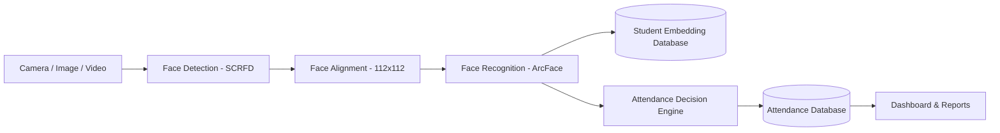

# Smart Attendance Management System (SAMS)

SAMS is an AI-powered attendance management platform that uses computer vision and facial recognition to automatically identify students and record attendance from live cameras, uploaded images, and recorded classroom videos.

---

## Key Features

- **Face Detection**: Single-shot multi-face detection and 5-point facial landmark localization powered by SCRFD (`buffalo_l`).
- **Face Recognition**: Deep 512-dimensional facial embedding extraction using ArcFace (ResNet-50).
- **Student Enrollment**: Web-based facial sample capture and automatic embedding vector generation.
- **Facial Embedding Generation**: Normalized feature vectors stored locally with fast matrix dot-product cosine matching.
- **Live Webcam Attendance**: Real-time browser-based video stream processing for instant classroom check-ins.
- **Mobile & IP Camera Integration**: Connect external mobile phone cameras and IP streams over local HTTP/MJPEG endpoints.
- **RTSP / CCTV Support**: Ingest continuous video feeds from institutional CCTV infrastructure via RTSP URLs.
- **Image-Based Attendance**: Upload high-resolution group photographs with automatic multi-face bounding-box annotations and batch attendance marking.
- **Video-Based Attendance**: Upload recorded lecture videos with configurable frame sampling, temporal consensus voting, and timestamped attendance summaries.
- **Face Tracking**: Persistent multi-face tracking across video frames using ByteTrack and Kalman filtering.
- **Duplicate Attendance Prevention**: Multi-layer safeguards (in-frame deduplication, presence state checks, and database-level unique constraints) prevent double-marking within the same session.
- **Attendance Session Management**: Create, schedule, activate, pause, and complete attendance sessions mapped to courses and classrooms.
- **Timetable Integration**: Weekly schedule grid with color-coded subject blocks and lab batch allocations.
- **Reports & Attendance History**: View attendance percentages, individual student presence histories, and export CSV reports.
- **Administrative Dashboard**: Real-time overview of active sessions, student statistics, system health, and AI engine status.

---

## System Architecture



For detailed architectural specifications, see [docs/ARCHITECTURE.md](docs/ARCHITECTURE.md).

---

## Technology Stack

### Frontend
- **Framework**: React 18
- **Language**: TypeScript 5.6
- **Build Tool**: Vite 5.4
- **Styling**: Tailwind CSS 3.4
- **Icons & UI**: Lucide React
- **HTTP Client**: Axios

### Backend
- **Framework**: FastAPI (ASGI)
- **Language**: Python 3.10+
- **Server**: Uvicorn
- **ORM / Database Access**: SQLAlchemy 2.0 (Async Engine)
- **Data Validation**: Pydantic V2
- **Authentication**: PyJWT & Bcrypt

### AI / Computer Vision
- **Face Analysis**: InsightFace (`buffalo_l` model pack)
- **Inference Runtime**: ONNX Runtime
- **Image Processing**: OpenCV 4.10 (`opencv-python`)
- **Numerical Computation**: NumPy & SciPy

### Database
- **Development (Default)**: SQLite via `aiosqlite` (zero-configuration local file)
- **Production**: PostgreSQL with `asyncpg`

---

## AI Recognition Pipeline

```text
Camera / Image / Video
          ↓
    Face Detection (SCRFD 10G)
          ↓
    Face Alignment (2D Affine Transform to 112x112)
          ↓
  Embedding Extraction (ArcFace ResNet-50)
          ↓
  Embedding Normalization (L2 Unit Vector)
          ↓
  Cosine Similarity Matching (Dot Product vs Gallery)
          ↓
    Confidence Threshold (Known >= 0.65, Candidate 0.40 - 0.64)
          ↓
  Student Identification
          ↓
   Duplicate Check (In-Frame & Session Constraint)
          ↓
   Attendance Marked (Committed to Database)
```

For the complete mathematical formulation and anti-spoofing details, see [docs/FACE_RECOGNITION.md](docs/FACE_RECOGNITION.md).

---

## Installation & Setup

### Prerequisites
- Python 3.10, 3.11, 3.12, or 3.14
- Node.js 18+ and npm
- Git

### 1. Clone the Repository
```bash
git clone https://github.com/YOUR_USERNAME/sams.git
cd sams
```

### 2. Configure Environment Variables
```bash
cp .env.example .env
```

### 3. Backend Setup
```bash
# Create and activate Python virtual environment
python3 -m venv .venv
source .venv/bin/activate   # On Windows: .venv\Scripts\activate

# Install Python dependencies
pip install --upgrade pip
pip install -r requirements.txt

# Seed clean demo dataset (fictional students, subjects, classes, and timetable)
python -m scripts.seed_demo_data

# Start the FastAPI server
uvicorn backend.app.main:app --host 0.0.0.0 --port 8000 --reload
```

Backend endpoints:
- **Swagger Documentation**: [http://localhost:8000/api/v1/docs](http://localhost:8000/api/v1/docs)
- **Health Check**: [http://localhost:8000/health](http://localhost:8000/health)

### 4. Frontend Setup
```bash
# In a new terminal window:
cd frontend
npm install
npm run dev
```

Open your browser at **[http://localhost:5173](http://localhost:5173)**.

For complete Docker instructions and GPU configuration, see [docs/INSTALLATION.md](docs/INSTALLATION.md).

---

## Camera Setup

SAMS supports five visual input sources:

1. **Laptop / USB Webcam**:
   - Navigate to **Live Attendance** in the frontend dashboard.
   - Grant browser camera permissions when prompted.
2. **Mobile IP Camera**:
   - Install a standard IP camera app on your smartphone (e.g. IP Webcam).
   - In **Camera Management**, add a camera with source `IP_CAMERA` and URL:
     ```text
     http://YOUR_MOBILE_IP:PORT/video
     ```
3. **RTSP CCTV Camera**:
   - In **Camera Management**, register an RTSP stream URL:
     ```text
     rtsp://YOUR_CAMERA_IP:554/stream
     ```
   - SAMS connects via background threaded workers and reconnects automatically if the stream drops.
4. **Uploaded Image**:
   - Navigate to **Media Attendance**, select **Image Attendance**, choose an attendance session, and upload a JPEG/PNG photo.
5. **Uploaded Video**:
   - In **Media Attendance**, select **Video Attendance**, upload a video file (MP4/AVI/MKV), and process it with multi-frame temporal voting.

---

## Project Structure

```text
SAMS/
├── ai_engine/               # Computer vision & recognition engine
│   ├── alignment/           # 2D similarity transform & landmark alignment
│   ├── detection/           # SCRFD face detector
│   ├── liveness/            # Texture & anti-spoofing checker
│   ├── pipeline/            # Face & video processing pipelines
│   ├── quality/             # Pose estimation & blur analysis
│   ├── recognition/         # ArcFace feature extractor & vector matcher
│   ├── streaming/           # Thread-safe RTSP capture worker
│   ├── tracking/            # ByteTrack & Kalman Filter tracker
│   └── verification/        # Temporal sliding-window verifier
│
├── backend/                 # FastAPI backend application
│   ├── alembic/             # Database migration scripts
│   ├── app/
│   │   ├── api/v1/          # REST API endpoints & routers
│   │   ├── core/            # App configuration, security & logging
│   │   ├── database/        # Async sessionmaker & SQLite adapter
│   │   ├── models/          # SQLAlchemy 2.0 ORM models
│   │   ├── schemas/         # Pydantic validation schemas
│   │   ├── services/        # Business logic & face recognition service
│   │   └── main.py          # FastAPI application entry point
│   └── main.py              # Root backend entry point
│
├── frontend/                # React 18 + Vite + TypeScript frontend
│   ├── src/
│   │   ├── components/      # Reusable UI components & ErrorBoundary
│   │   ├── features/        # Feature pages (Attendance, Live, Media, etc.)
│   │   ├── layouts/         # Dashboard layout & sidebar navigation
│   │   ├── services/        # API client modules
│   │   ├── types/           # TypeScript interfaces
│   │   └── App.tsx          # Main application component & routes
│   ├── package.json         # Frontend dependencies & scripts
│   └── vite.config.ts       # Vite bundler configuration
│
├── docs/                    # Technical documentation
│   ├── API.md               # REST & WebSocket API specification
│   ├── ARCHITECTURE.md      # Detailed system architecture
│   ├── DEMO_GUIDE.md        # Presentation & demonstration script
│   ├── FACE_RECOGNITION.md  # AI pipeline mathematical reference
│   └── INSTALLATION.md      # Installation & deployment guide
│
├── sample-data/             # Sample dataset guidelines
├── scripts/                 # Database seeders & lifecycle scripts
├── tests/                   # Automated test suite (102 tests)
├── .env.example             # Environment configuration template
├── .gitignore               # Build, database, and biometric ignore rules
├── docker-compose.yml       # Docker container orchestration
├── LICENSE                  # MIT License
├── package.json             # Root metadata & scripts
└── requirements.txt         # Python package dependencies
```

---

## Usage Workflow

1. **Add Students**: Go to **Students** and create student profiles with department, class, and roll number.
2. **Enroll Facial Images**: Open **Face Enrollment**, select a student, capture 3–5 face samples across angles, and complete enrollment.
3. **Generate Embeddings**: Face embeddings are extracted and normalized automatically during enrollment.
4. **Create Academic Sessions**: In **Attendance**, select a subject and class section, and open a session.
5. **Connect Camera**: In **Camera Management**, verify webcam, mobile IP camera, or RTSP feed connectivity.
6. **Start Live Attendance**: Open **Live Attendance** to recognize students in real-time from the video feed.
7. **Media Attendance**: Upload classroom photographs or lecture videos in **Media Attendance** for automated batch recognition.
8. **Review Attendance**: Check live attendance counts, marked timestamps, and detection confidence scores.
9. **Generate Reports**: In **Reports**, review attendance metrics and export CSV summaries.

---

## Accuracy and Recognition Factors

Facial recognition accuracy in real-world deployments depends on environmental and operational factors:
- **Lighting Conditions**: Even, diffused lighting produces optimal results; strong backlighting or deep shadows can reduce detection confidence.
- **Face Angle & Pose**: SCRFD and ArcFace operate effectively on yaw and pitch angles up to ±35°; extreme profile views require repositioning.
- **Occlusion**: Partial occlusions (masks, hands, glasses) are handled via multi-frame temporal voting, which waits for clear frames before confirming identity.
- **Image Resolution**: Faces must have a minimum bounding-box dimension of 60×60 pixels for reliable embedding extraction.
- **Enrollment Quality**: Enrolling 3–5 clean, well-lit samples per student significantly improves matching reliability.
- **Configurable Thresholds**: The similarity threshold (default: 0.65) can be adjusted in **Settings** to balance true positives and false acceptance rates.

---

## Privacy and Security

- **Local Mathematical Embeddings**: SAMS converts facial images into dense 512-dimensional numerical vectors. Real raw photographs are not exposed publicly.
- **No Biometric Data in Version Control**: Facial embedding files (`.npy`, `.onnx`) and database files (`*.db`) are strictly excluded from Git tracking via `.gitignore`.
- **Institutional Compliance**: Facial biometric systems should be operated in compliance with applicable data protection regulations (such as GDPR, FERPA, or local data privacy laws) and with informed student consent.

---

## Testing

Run the full automated test suite (102 tests):
```bash
pytest
```

---

## Documentation

- [System Architecture](docs/ARCHITECTURE.md)
- [Installation Guide](docs/INSTALLATION.md)
- [REST & WebSocket API Reference](docs/API.md)
- [Face Recognition Pipeline](docs/FACE_RECOGNITION.md)
- [Showcase Demonstration Script](docs/DEMO_GUIDE.md)

---

## License

This project is licensed under the MIT License — see the [LICENSE](LICENSE) file for details.
