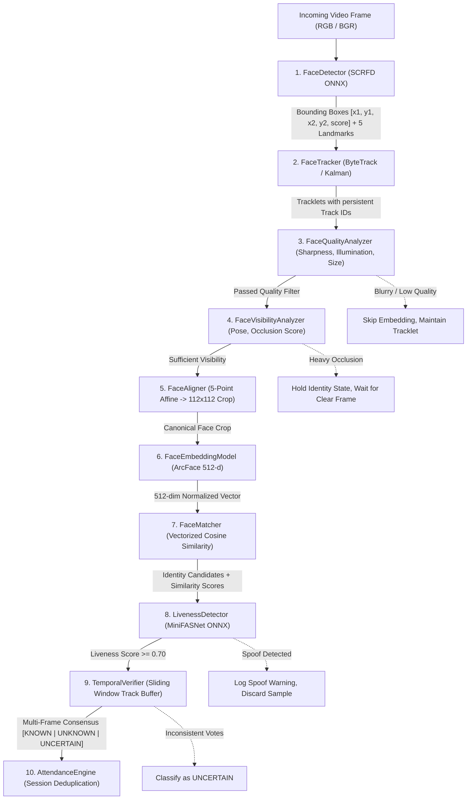

# AI Computer Vision Pipeline — Detailed Specification

**Document Version:** 1.0.0  
**Phase:** Phase 0 (AI & Pipeline Architecture)  
**Status:** Approved Technical Specification

---

## 1. Pipeline Overview & Component Interfaces

The AI pipeline is designed as a sequence of decoupled, modular, and independently testable Python components. No monolithic scripts are permitted.



### 1.1 Standard Component Interfaces (Abstract Base Classes)

```python
from abc import ABC, abstractmethod
from dataclasses import dataclass
from typing import List, Optional, Tuple, Dict, Any
import numpy as np

@dataclass
class BoundingBox:
    x1: float
    y1: float
    x2: float
    y2: float
    score: float

@dataclass
class DetectedFace:
    bbox: BoundingBox
    landmarks: np.ndarray  # Shape: (5, 2) [left_eye, right_eye, nose, left_mouth, right_mouth]
    det_score: float

@dataclass
class TrackedFace:
    track_id: int
    face: DetectedFace
    age_frames: int
    hits: int
    time_since_update: int
    state: str  # 'Tentative', 'Confirmed', 'Occluded', 'Lost'

@dataclass
class QualityMetrics:
    sharpness: float       # Laplacian variance [0.0 - 1000.0+]
    brightness: float      # Mean pixel intensity [0.0 - 255.0]
    face_width: int        # Width in pixels
    face_height: int       # Height in pixels
    is_valid: bool         # Meets minimum quality thresholds
    rejection_reason: Optional[str] = None

@dataclass
class PoseAndOcclusion:
    yaw: float             # In degrees (-90 to +90)
    pitch: float           # In degrees (-90 to +90)
    roll: float            # In degrees (-180 to +180)
    occlusion_score: float # 0.0 (unoccluded) to 1.0 (fully occluded)
    is_acceptable: bool
    rejection_reason: Optional[str] = None

@dataclass
class MatchCandidate:
    student_id: str
    name: str
    roll_number: str
    similarity: float      # Cosine similarity in range [-1.0, 1.0]

@dataclass
class VerificationDecision:
    decision: str          # 'KNOWN', 'UNKNOWN', 'UNCERTAIN'
    student_id: Optional[str]
    name: Optional[str]
    confidence: float
    liveness_score: float
    temporal_votes: int
    total_frames_evaluated: int
```

---

## 2. Detailed Pipeline Stages

### Stage 1: Face Detection (`FaceDetector`)

- **Underlying Model:** SCRFD (Sample and Computation Redistribution for Efficient Face Detection) via ONNX Runtime.
- **Model Variants Supported:**
  - `scrfd_500m_bnkps` (Ultralight for low-end CPUs / Mobile Edge).
  - `scrfd_2.5g_kps` (Default production model: excellent precision for side profiles and partial occlusions).
- **Inference Configuration:**
  - Input resolution: $640 \times 640$ (or $320 \times 320$ for lightweight edge).
  - Non-Maximum Suppression (NMS) IoU threshold: $0.40$.
  - Detection confidence threshold $\tau_{\text{det}} \ge 0.50$.
- **Output:** Bounding box coordinates $[x_1, y_1, x_2, y_2]$ and 5 fiducial landmarks (eyes, nose tip, mouth corners).

### Stage 2: Multi-Face Tracking (`FaceTracker`)

- **Algorithm:** ByteTrack with Kalman Filter motion estimation.
- **Key Advantage:** Unlike standard SORT which discards low-confidence detections, ByteTrack associates low-score detections in subsequent frames to preserve tracks of students undergoing temporary motion blur or partial obstruction.
- **Track Lifecycle States:**
  1. `TENTATIVE`: Newly detected bounding box; requires 2 consecutive frame associations to confirm.
  2. `CONFIRMED`: Active track receiving continuous detections.
  3. `OCCLUDED`: Track temporarily unmatched due to passing obstacles; position predicted by Kalman filter for up to $M_{\text{max}}=15$ frames.
  4. `LOST / DELETED`: Unmatched for $> 30$ frames; tracklet is retired and memory purged.

### Stage 3: Face Quality Analysis (`FaceQualityAnalyzer`)

- **Objective:** Eliminate unusable face crops before executing expensive embedding inference.
- **Quality Checks:**
  1. **Minimum Resolution:** Bounding box width and height $\ge 80 \text{ pixels}$.
  2. **Sharpness / Blur Metric:** Modified Laplacian variance:
     $$\text{Var}(\nabla^2 I) \ge \tau_{\text{blur}} = 65.0$$
  3. **Illumination Distribution:** Mean grayscale pixel intensity:
     $$40 \le \mu_{\text{gray}} \le 225$$
  4. **Boundary Margin Check:** Face bounding box must not touch image boundaries by $> 5\%$.

### Stage 4: Pose & Occlusion Visibility Assessment (`FaceVisibilityAnalyzer`)

- **Head Pose Estimation:**
  - Computed using 5-point landmark geometry mapped against a canonical 3D facial coordinate template (Perspective-n-Point):
    - Yaw angle: $|\theta_{\text{yaw}}| \le 35^\circ$
    - Pitch angle: $|\theta_{\text{pitch}}| \le 25^\circ$
    - Roll angle: $|\theta_{\text{roll}}| \le 30^\circ$
- **Occlusion Evaluation:**
  - Ratio of inter-ocular distance to nose-to-mouth distance compared against canonical ratio.
  - If glasses, hands, or masks distort facial symmetry beyond threshold $\tau_{\text{occ}} > 0.45$, the frame is marked as `OCCLUDED_CANDIDATE`.
  - **Decision Rule:** The tracker continues tracking the face, but **NO** identity decision is finalized until a frame with $\tau_{\text{occ}} \le 0.45$ is captured.

### Stage 5: Face Alignment (`FaceAligner`)

- **Technique:** Standard 2D Affine Similarity Transformation (Scale, Rotation, Translation).
- **Target Matrix:** Five standard ArcFace landmark anchor points:
  - Left Eye: $(38.2946, 51.6963)$
  - Right Eye: $(73.5318, 51.5014)$
  - Nose Tip: $(56.0252, 71.7366)$
  - Left Mouth Corner: $(41.5493, 92.3655)$
  - Right Mouth Corner: $(70.7299, 92.2041)$
- **Output Crop:** Normalized $112 \times 112 \times 3$ RGB float32 image in range $[-1.0, 1.0]$.

### Stage 6: Face Embedding Generation (`FaceEmbeddingModel`)

- **Model:** ArcFace (Additive Angular Margin Loss) ONNX.
- **Backbone:** ResNet-50 or MobileFaceNet.
- **Output Dimension:** 512-dimensional float32 vector $\mathbf{v} \in \mathbb{R}^{512}$.
- **Normalization:** Mandatory $L_2$ unit normalization:
  $$\hat{\mathbf{v}} = \frac{\mathbf{v}}{\|\mathbf{v}\|_2}, \quad \|\hat{\mathbf{v}}\|_2 = 1.0$$

### Stage 7: Similarity Search & Matching (`FaceMatcher`)

- **Metric:** Cosine Similarity $\cos(\theta) = \mathbf{q} \cdot \mathbf{t}$ (since vectors are unit-normalized, inner product equals cosine similarity).
- **Live Memory Matrix Cache:**
  - Stacked $N \times 512$ matrix $\mathbf{M}$ containing all enrolled student embeddings.
  - Inference: $\mathbf{s} = \mathbf{M} \mathbf{q}^T$ (single vectorized BLAS matrix-vector product in $< 1.5\text{ms}$).
- **Database Backup:** PostgreSQL `pgvector` HNSW cosine distance operator (`<=>`).

### Stage 8: Three-State Identity Classification (`IdentityClassifier`)

The system strictly prohibits binary forced matching. It evaluates similarity against calibrated thresholds:

$$
\text{Decision} = \begin{cases}
\text{KNOWN} & \text{if } \max(\mathbf{s}) \ge \tau_{\text{known}} \ (0.65) \text{ and } (\max_1 - \max_2) \ge \Delta_{\text{margin}} \ (0.08) \\
\text{UNCERTAIN} & \text{if } \tau_{\text{uncertain}} \le \max(\mathbf{s}) < \tau_{\text{known}} \ (0.45 \le s < 0.65) \text{ or margin ambiguous} \\
\text{UNKNOWN} & \text{if } \max(\mathbf{s}) < \tau_{\text{uncertain}} \ (0.45)
\end{cases}
$$

---

## 3. Temporal Multi-Frame Verification (`TemporalVerifier`)

To prevent transient misclassifications from motion blur or fleeting occlusions, the verifier maintains a rolling historical buffer for each active `track_id`:

- **Sliding Window Size:** $W = 7 \text{ observations}$.
- **Minimum Required Valid Frames:** $K = 4 \text{ observations}$.
- **Consensus Rule:**
  - Identity $S_i$ must receive at least $75\%$ of the votes in the window.
  - The mean cosine similarity of $S_i$ across the window must exceed $0.65$.
  - The mean liveness score must exceed $0.70$.
- If consensus is not reached within window $W$, the track remains in `UNCERTAIN` state without triggering attendance.

---

## 4. Liveness & Anti-Spoofing Architecture (`LivenessDetector`)

- **Primary Model:** MiniFASNet (Silent-Face-Anti-Spoofing) with multi-scale Fourier frequency spectrum and high-frequency texture analysis.
- **Attack Types Detected:**
  1. 2D Printed Paper / Photo Cutout Attacks (detected via surface reflection & lack of 3D depth).
  2. Mobile Screen / Tablet Video Replay Attacks (detected via screen moiré patterns and chromatic aberration).
  3. 3D Rigid Mask Attacks (detected via micro-texture anomaly).
- **Liveness Output:** Score $L \in [0.0, 1.0]$. Only faces with $L \ge 0.70$ proceed to the Attendance Engine.

---

## 5. Partial Occlusion & Edge Case Strategy

| Scenario                             | Behavior & Recovery Mechanism                                                                                                                                                                                                           |
| :----------------------------------- | :-------------------------------------------------------------------------------------------------------------------------------------------------------------------------------------------------------------------------------------- |
| **Mask / Hand Occlusion**            | Visibility Analyzer scores $\tau_{\text{occ}} > 0.45$. Tracker continues predicting bounding box trajectory with Kalman filter. Verification is paused until hand/mask lowers, at which point valid frames populate the sliding window. |
| **Prescription Glasses**             | ArcFace is trained with high angular margin on eye regions; fiducial alignment preserves eye coordinates. If glare is detected, quality filter requests minor head adjustment.                                                          |
| **Student Walking Fast Past Camera** | ByteTrack maintains tracklet across 12-15 frames. Fast motion frames with blur $\text{Var} < 65$ are dropped; only sharpest 4 frames are embedded.                                                                                      |
| **Two Students Crossing Paths**      | ByteTrack uses Hungarian IoU matching to maintain independent track IDs without track identity swapping.                                                                                                                                |

---

## 6. Performance & Latency Budgets (Target: Real-Time 15-20 FPS on CPU)

| Pipeline Step                    | Target Latency (CPU i5/i7/Ryzen) | Optimization Strategy                                                        |
| :------------------------------- | :------------------------------- | :--------------------------------------------------------------------------- |
| **Face Detection (SCRFD)**       | $12 - 18\text{ ms}$              | Downsample input to $320\times 320$ or $640\times 640$; run every 3rd frame. |
| **Face Tracking (ByteTrack)**    | $1 - 2\text{ ms}$                | Pure NumPy Kalman state prediction on non-detection frames.                  |
| **Quality & Pose Analysis**      | $< 1\text{ ms}$                  | Fast vectorized NumPy Laplacian & landmark trigonometry.                     |
| **Face Alignment (Affine)**      | $< 1\text{ ms}$                  | OpenCV `cv2.warpAffine` $(112\times 112)$.                                   |
| **ArcFace Embedding**            | $20 - 30\text{ ms}$              | Run ONNX Runtime with OpenMP multithreading; run only on keyframes.          |
| **Cosine Search (10k Students)** | $< 1.5\text{ ms}$                | Vectorized matrix multiplication (`np.matmul`).                              |
| **Liveness Check**               | $8 - 12\text{ ms}$               | Run MiniFASNet once per tracklet upon initial identification.                |
| **Total Frame Latency**          | **$45 - 65\text{ ms}$**          | **Satisfies real-time 15-20 FPS requirement.**                               |
