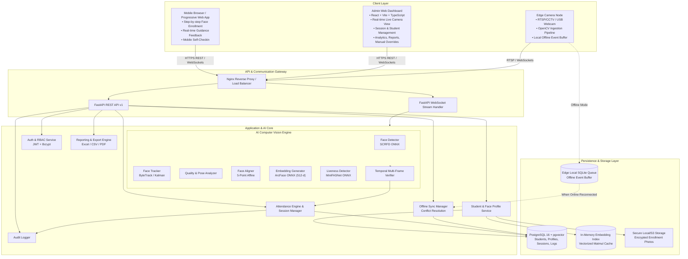
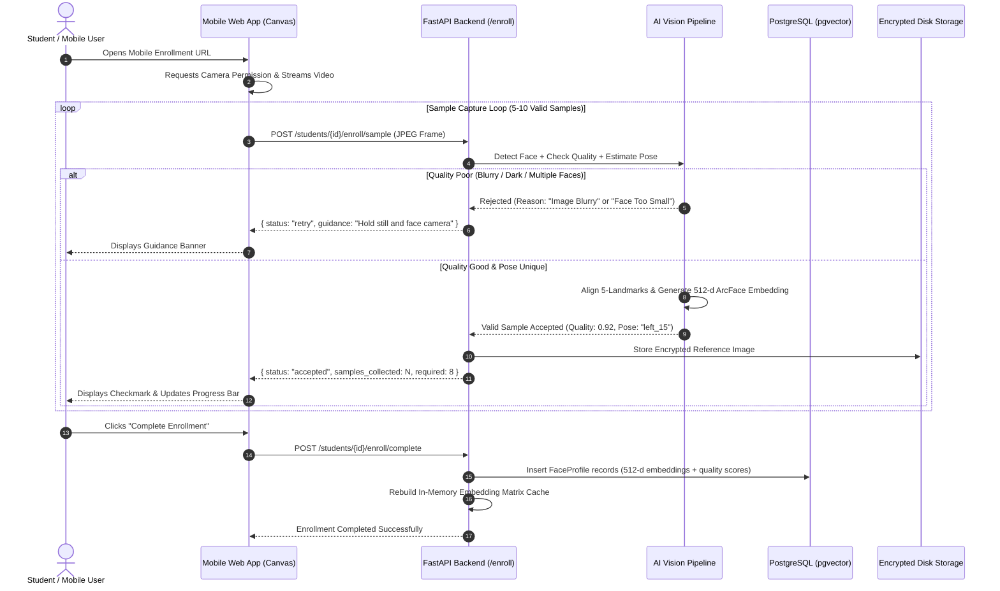
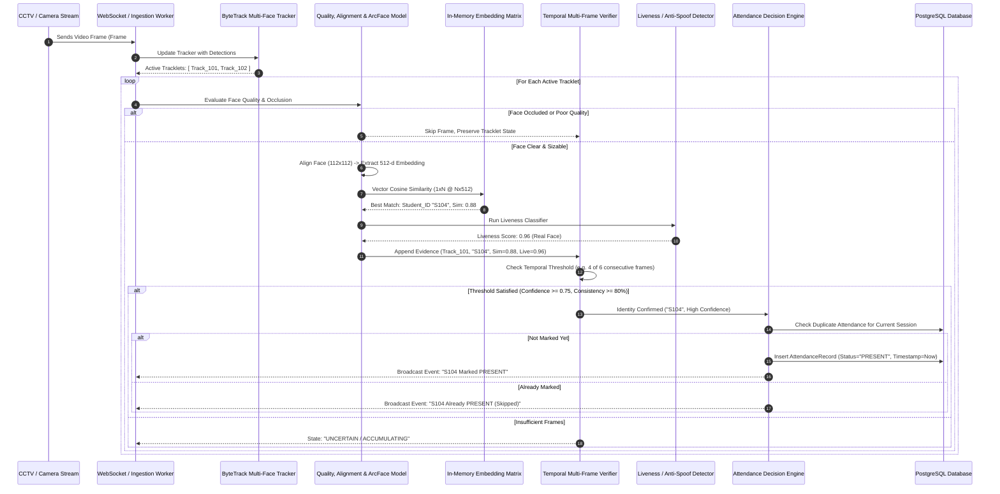

# JOJIPA-SAMS — System Architecture

## Smart Attendance Management System

**Document Version:** 1.0.0  
**Status:** Approved Architectural Specification

---

## 1. Executive Summary & Core Design Philosophy

The **JOJIPA-SAMS (Smart Attendance Management System)** is an enterprise-grade biometric attendance and automated identity verification platform designed for academic classrooms, lecture halls, campus gates, and corporate environments.

### Core Architectural Principle

A single face detected in a single video frame **MUST NEVER** directly trigger attendance. Production-grade recognition systems must handle real-world challenges: motion blur, poor lighting, extreme angles, glasses, masks, hand-to-face occlusion, photo spoofing, and identity ambiguity.

```
Camera / Mobile Stream
       ↓
Face Detection (SCRFD / RetinaFace)
       ↓
Multi-Face Tracking (ByteTrack / IoU Tracklet Association)
       ↓
Face Quality Assessment (Sharpness, Illumination, Size)
       ↓
Occlusion & Pose Visibility Assessment (Yaw, Pitch, Roll & Landmark Confidence)
       ↓
Face Alignment & Geometric Normalization (5 Fiducial Landmarks → 112×112)
       ↓
Embedding Generation (ArcFace 512-dim Feature Vector)
       ↓
Vector Similarity Search (pgvector HNSW Cosine Metric)
       ↓
Temporal Multi-Frame Verification (Sliding Window Tracklet Accumulation)
       ↓
Liveness / Anti-Spoof Verification (Texture & Landmark Dynamics)
       ↓
Classification: [ KNOWN | UNKNOWN | UNCERTAIN ]
       ↓
Attendance Engine (Session Eligibility, Duplicate Guard, Cooldown Filter)
       ↓
PostgreSQL Database + Audit Log
       ↓
Real-Time Dashboard & Exportable Reports
```

---

## 2. High-Level System Architecture



---

## 3. Technology Stack Justification

| Layer                      | Selected Technology                               | Version / Specification                              | Rationale & Alternatives Considered                                                                                                                                            |
| :------------------------- | :------------------------------------------------ | :--------------------------------------------------- | :----------------------------------------------------------------------------------------------------------------------------------------------------------------------------- |
| **Backend Framework**      | **FastAPI**                                       | 0.115+ (Python 3.10-3.14)                            | High async I/O throughput, native OpenAPI docs, Pydantic v2 data validation, built-in WebSocket support. Superior to Django/Flask for real-time AI endpoints.                  |
| **Database**               | **PostgreSQL + pgvector**                         | PostgreSQL 16, pgvector 0.7+                         | Enterprise ACID compliance, relational integrity for sessions/students, native HNSW indexing for 512-d vectors. Eliminates separate vector DB overhead (e.g. Milvus/Pinecone). |
| **ORM & Migrations**       | **SQLAlchemy 2.0 + Alembic**                      | Async Engine                                         | Type-safe queries, migration reproducibility across staging/production environments.                                                                                           |
| **Frontend Framework**     | **React + TypeScript + Vite**                     | React 18/19, Vite 5+, TS 5+                          | Fast build times, strong type safety, reactive canvas/webcam processing, component modularity.                                                                                 |
| **UI Styling**             | **Tailwind CSS + Lucide Icons**                   | Tailwind 3.4+                                        | Modern responsive utility classes, zero runtime overhead, mobile-first design for enrollment.                                                                                  |
| **Face Detection**         | **SCRFD (Sample and Computation Redistribution)** | ONNX Runtime (`scrfd_500m_bnkps` / `scrfd_2.5g_kps`) | Real-time multi-scale detection (10ms on CPU), highly robust to side poses, outputs 5 precise fiducial facial landmarks. Outperforms MTCNN and standard Haar Cascades.         |
| **Face Embedding**         | **ArcFace (ResNet50 / MobileFaceNet)**            | 512-dimensional output, ONNX Runtime                 | State-of-the-art Angular Margin Loss embedding space with high inter-class separation and intra-class compactness. Open license, CPU & GPU inference ready.                    |
| **Face Tracking**          | **ByteTrack (Kalman Filter + IoU/ReID)**          | Custom Lightweight Python implementation             | Preserves low-confidence detections across occluded frames, prevents track fragmentation, associates continuous face trajectories.                                             |
| **Liveness / Anti-Spoof**  | **MiniFASNet (Silent-Face-Anti-Spoofing)**        | Multi-scale Fourier + Texture ONNX                   | Passive single-frame and multi-frame anti-spoofing; detects 2D print attacks, tablet/screen playback attacks with minimal latency overhead.                                    |
| **In-Memory Cache**        | **NumPy Vectorized Matrix**                       | Float32 $N \times 512$ Matrix                        | Single vectorized matrix multiplication (`Q @ M.T`) executes cosine similarity for 10,000 students in $< 1.2\text{ ms}$ on standard CPU.                                       |
| **Deployment / Container** | **Docker & Docker Compose**                       | Multi-stage Dockerfiles                              | Reproducible environment, isolated dependencies, pgvector support out-of-the-box.                                                                                              |

---

## 4. Subsystem Architectures

### 4.1 Frontend Architecture (Admin Dashboard & Mobile Enrollment)

The web application is structured as a unified Responsive Single Page Application (SPA):

1. **Mobile Enrollment PWA:**
   - Designed for standard smartphone browsers (Chrome, Safari, Firefox).
   - Real-time video frame analysis directly on canvas.
   - Intelligent visual guidance prompts: _"Move closer"_, _"Turn slightly left"_, _"Lighting too dark"_, _"Hold steady"_.
   - Captures 5 to 10 calibrated samples across varying yaw angles ($\pm 15^\circ$), pitch angles ($\pm 10^\circ$), and lighting conditions.
2. **Admin & Faculty Dashboard:**
   - **Live Attendance Monitor:** Multi-camera grid with bounding box overlays, track IDs, recognized names, and live attendance badges.
   - **Session Manager:** Create and control active attendance sessions with custom timeframes, subjects, and room bindings.
   - **Student Directory:** Searchable table with enrollment status, face sample preview, manual re-enrollment, and student detail drawers.
   - **Reports & Analytics:** Attendance graphs, monthly aggregates, student percentage trackers, CSV/Excel/PDF export.
   - **Manual Attendance Correction:** Audit-backed override interface to correct mistaken attendance with admin remarks.
   - **Camera Management:** Configure RTSP URLs, webcam devices, and monitor FPS/health status.

### 4.2 Backend Architecture & Service Separation

The backend follows strict **Clean Architecture** with separation of concerns:

- `api/v1/`: Routing layer containing HTTP REST endpoints and WebSocket stream handlers.
- `schemas/`: Pydantic request/response validation schemas.
- `models/`: SQLAlchemy ORM database models.
- `services/`: Business logic layer (`StudentService`, `AttendanceService`, `SessionService`, `ReportService`, `AuditService`).
- `ai/`: Independent AI computer vision modules with unified interfaces.
- `core/`: Application settings, security utilities (JWT, password hashing), and structured logging.
- `database/`: Database engine, connection pooling, and session management.

---

## 5. End-to-End Data Flow

### 5.1 Face Enrollment Flow



### 5.2 Real-Time Attendance Stream & Decision Flow



---

## 6. Resilience, Security, and Offline Architecture

### 6.1 Biometric Privacy & Protection

- **No Raw Vector Exfiltration:** Embeddings are treated as irreversible mathematical hash representations of facial geometry.
- **Image Storage Encryption:** Enrollment reference photos are stored with AES-256 encryption on disk with restricted POSIX file permissions.
- **Role-Based Access Control (RBAC):**
  - `ADMIN`: Full CRUD on students, sessions, cameras, face templates, and manual overrides.
  - `FACULTY`: View sessions, trigger session attendance, view class reports, submit attendance adjustments.
  - `STUDENT`: View own attendance records and enrollment status.
- **Audit Logging:** Every manual attendance modification, student deletion, or face re-enrollment writes an immutable audit record containing `user_id`, `timestamp`, `ip_address`, `old_value`, and `new_value`.

### 6.2 Edge & Offline Synchronization

When internet/backend connectivity drops at a classroom camera station:

1. The Edge Ingestion client logs attendance events locally to a lightweight SQLite database (`sync_queue`).
2. An event contains: `event_uuid`, `session_id`, `student_id`, `camera_id`, `first_seen`, `confidence`, `snapshot_hash`.
3. When network connectivity resumes, the edge node triggers `POST /api/v1/sync/push`.
4. The server processes the queue with **idempotent deduplication**, ensuring that no student receives duplicate attendance even if synchronization packets are retransmitted.

---

## 7. Architectural Risk Analysis & Mitigations

| Identified Risk                                    | Potential Impact                          | Architectural Mitigation Strategy                                                                                                                                        |
| :------------------------------------------------- | :---------------------------------------- | :----------------------------------------------------------------------------------------------------------------------------------------------------------------------- |
| **High CPU usage on multi-face classroom streams** | Dropped frames, lag in UI                 | Interleaved pipeline: Detect faces every $N=3$ frames; use lightweight IoU/Kalman tracking on intermediate frames. Run recognition only on high-quality track keyframes. |
| **Partial Occlusion (Masks, Glasses, Hands)**      | False Rejection or Mistaken Identity      | Occlusion analyzer flags partial visibility; identity decision is held in `UNCERTAIN` state until a clear unoccluded frame is tracked.                                   |
| **Photo / Screen Spoof Attacks**                   | Fraudulent Attendance                     | Dual-stage anti-spoofing (Fourier frequency analysis + MiniFASNet ONNX) integrated before temporal verification.                                                         |
| **Duplicate Attendance in High-Traffic Doors**     | Cluttered logs, database write contention | Session-level uniqueness constraints in PostgreSQL + In-memory session presence sets (`marked_today`).                                                                   |
| **Network Drops in Rural / Edge Campuses**         | Lost attendance records                   | Local SQLite offline queue with automatic exponential backoff retry and idempotent sync API.                                                                             |
