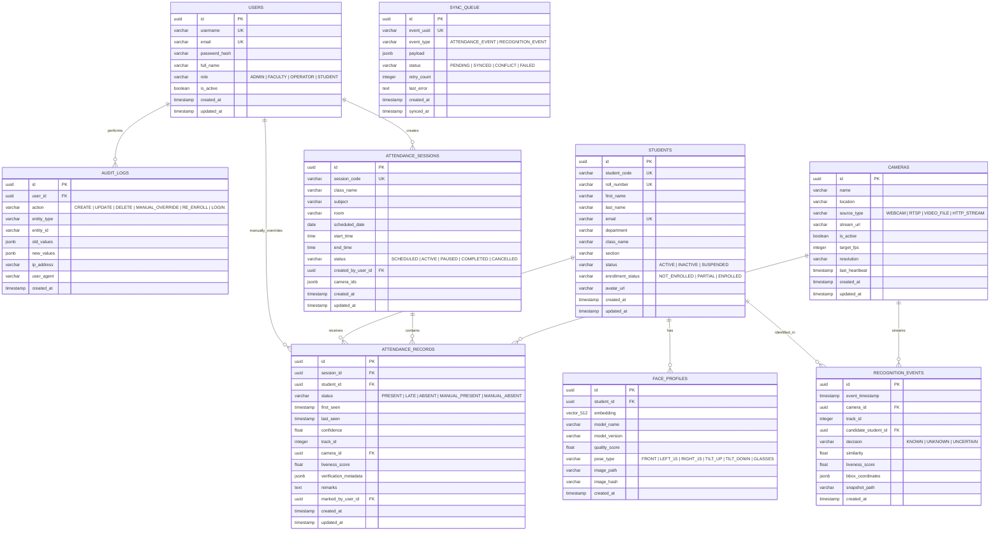

# Database Architecture & Schema Specification

**Document Version:** 1.0.0  
**Phase:** Phase 0 (Data Architecture & Modeling)  
**Status:** Approved Schema Design

---

## 1. Database Architecture & Engine Selection

- **Primary Database:** **PostgreSQL 16+** with the **`pgvector`** extension enabled.
- **ORM / Query Layer:** **SQLAlchemy 2.0 (Async Engine)** with type annotations.
- **Migration Manager:** **Alembic** with versioned migration scripts.
- **Edge / Offline Node Engine:** Embedded **SQLite 3** for local event caching and synchronization queue.

### Why PostgreSQL + pgvector?

1. **Relational Integrity:** Strict foreign key constraints and ACID transaction semantics are vital for attendance records, student profiles, and audit histories.
2. **Native Vector Storage:** Storing 512-dimensional ArcFace float32 vectors directly in `vector(512)` columns allows native HNSW indexing for $O(\log N)$ approximate nearest neighbor search directly in SQL without needing a separate vector database.
3. **JSONB Support:** Highly performant storage of temporal verification traces, bounding box arrays, and audit diffs.

---

## 2. Entity Relationship Diagram (ERD)



---

## 3. Table Schema Definitions & DDL

### 3.1 Extension Initialization

```sql
CREATE EXTENSION IF NOT EXISTS "uuid-ossp";
CREATE EXTENSION IF NOT EXISTS "vector";
```

### 3.2 `users` Table

```sql
CREATE TABLE users (
    id UUID PRIMARY KEY DEFAULT uuid_generate_v4(),
    username VARCHAR(64) UNIQUE NOT NULL,
    email VARCHAR(255) UNIQUE NOT NULL,
    password_hash VARCHAR(255) NOT NULL,
    full_name VARCHAR(128) NOT NULL,
    role VARCHAR(32) NOT NULL DEFAULT 'FACULTY', -- ADMIN, FACULTY, OPERATOR, STUDENT
    is_active BOOLEAN NOT NULL DEFAULT TRUE,
    created_at TIMESTAMPTZ NOT NULL DEFAULT NOW(),
    updated_at TIMESTAMPTZ NOT NULL DEFAULT NOW()
);
CREATE INDEX idx_users_username ON users (username);
CREATE INDEX idx_users_role ON users (role);
```

### 3.3 `students` Table

```sql
CREATE TABLE students (
    id UUID PRIMARY KEY DEFAULT uuid_generate_v4(),
    student_code VARCHAR(32) UNIQUE NOT NULL, -- e.g. "STU-2026-001"
    roll_number VARCHAR(32) UNIQUE NOT NULL,  -- e.g. "CSE-2026-45"
    first_name VARCHAR(64) NOT NULL,
    last_name VARCHAR(64) NOT NULL,
    email VARCHAR(255) UNIQUE NOT NULL,
    department VARCHAR(64) NOT NULL,          -- e.g. "Computer Science & Engineering"
    class_name VARCHAR(32) NOT NULL,          -- e.g. "CSE-3A"
    section VARCHAR(16) NOT NULL DEFAULT 'A',
    status VARCHAR(32) NOT NULL DEFAULT 'ACTIVE', -- ACTIVE, INACTIVE, SUSPENDED
    enrollment_status VARCHAR(32) NOT NULL DEFAULT 'NOT_ENROLLED', -- NOT_ENROLLED, PARTIAL, ENROLLED
    avatar_url VARCHAR(512),
    created_at TIMESTAMPTZ NOT NULL DEFAULT NOW(),
    updated_at TIMESTAMPTZ NOT NULL DEFAULT NOW()
);
CREATE INDEX idx_students_roll_number ON students (roll_number);
CREATE INDEX idx_students_class_dept ON students (department, class_name, section);
CREATE INDEX idx_students_status ON students (status, enrollment_status);
```

### 3.4 `face_profiles` Table (Vector Storage)

```sql
CREATE TABLE face_profiles (
    id UUID PRIMARY KEY DEFAULT uuid_generate_v4(),
    student_id UUID NOT NULL REFERENCES students(id) ON DELETE CASCADE,
    embedding VECTOR(512) NOT NULL,
    model_name VARCHAR(64) NOT NULL DEFAULT 'ArcFace-ResNet50',
    model_version VARCHAR(32) NOT NULL DEFAULT '1.0.0',
    quality_score FLOAT NOT NULL,
    pose_type VARCHAR(32) NOT NULL DEFAULT 'FRONT', -- FRONT, LEFT_15, RIGHT_15, TILT_UP, TILT_DOWN, GLASSES
    image_path VARCHAR(512),
    image_hash VARCHAR(64), -- SHA-256 hash of raw image
    created_at TIMESTAMPTZ NOT NULL DEFAULT NOW()
);
CREATE INDEX idx_face_profiles_student ON face_profiles (student_id);

-- HNSW Vector Index for ultra-fast approximate cosine similarity search
CREATE INDEX idx_face_profiles_embedding_hnsw ON face_profiles
USING hnsw (embedding vector_cosine_ops)
WITH (m = 16, ef_construction = 64);
```

### 3.5 `attendance_sessions` Table

```sql
CREATE TABLE attendance_sessions (
    id UUID PRIMARY KEY DEFAULT uuid_generate_v4(),
    session_code VARCHAR(64) UNIQUE NOT NULL, -- e.g. "SESS-20260830-CSE3A-CN"
    class_name VARCHAR(32) NOT NULL,
    subject VARCHAR(64) NOT NULL,
    room VARCHAR(32) NOT NULL,
    scheduled_date DATE NOT NULL DEFAULT CURRENT_DATE,
    start_time TIME NOT NULL,
    end_time TIME NOT NULL,
    status VARCHAR(32) NOT NULL DEFAULT 'SCHEDULED', -- SCHEDULED, ACTIVE, PAUSED, COMPLETED, CANCELLED
    created_by_user_id UUID REFERENCES users(id) ON DELETE SET NULL,
    camera_ids JSONB DEFAULT '[]'::jsonb,
    created_at TIMESTAMPTZ NOT NULL DEFAULT NOW(),
    updated_at TIMESTAMPTZ NOT NULL DEFAULT NOW()
);
CREATE INDEX idx_sessions_date_class ON attendance_sessions (scheduled_date, class_name);
CREATE INDEX idx_sessions_status ON attendance_sessions (status);
```

### 3.6 `attendance_records` Table (Deduplication Enforced)

```sql
CREATE TABLE attendance_records (
    id UUID PRIMARY KEY DEFAULT uuid_generate_v4(),
    session_id UUID NOT NULL REFERENCES attendance_sessions(id) ON DELETE CASCADE,
    student_id UUID NOT NULL REFERENCES students(id) ON DELETE CASCADE,
    status VARCHAR(32) NOT NULL DEFAULT 'PRESENT', -- PRESENT, LATE, ABSENT, MANUAL_PRESENT, MANUAL_ABSENT
    first_seen TIMESTAMPTZ NOT NULL DEFAULT NOW(),
    last_seen TIMESTAMPTZ NOT NULL DEFAULT NOW(),
    confidence FLOAT NOT NULL DEFAULT 1.0,
    track_id INTEGER,
    camera_id UUID REFERENCES cameras(id) ON DELETE SET NULL,
    liveness_score FLOAT DEFAULT 1.0,
    verification_metadata JSONB DEFAULT '{}'::jsonb,
    remarks TEXT,
    marked_by_user_id UUID REFERENCES users(id) ON DELETE SET NULL,
    created_at TIMESTAMPTZ NOT NULL DEFAULT NOW(),
    updated_at TIMESTAMPTZ NOT NULL DEFAULT NOW(),

    -- Strict constraint: One attendance record per student per session
    CONSTRAINT uq_session_student UNIQUE (session_id, student_id)
);
CREATE INDEX idx_att_records_session_status ON attendance_records (session_id, status);
CREATE INDEX idx_att_records_student ON attendance_records (student_id);
```

### 3.7 `cameras` Table

```sql
CREATE TABLE cameras (
    id UUID PRIMARY KEY DEFAULT uuid_generate_v4(),
    name VARCHAR(64) NOT NULL,
    location VARCHAR(128) NOT NULL,
    source_type VARCHAR(32) NOT NULL DEFAULT 'WEBCAM', -- WEBCAM, RTSP, VIDEO_FILE, HTTP_STREAM
    stream_url VARCHAR(512),
    is_active BOOLEAN NOT NULL DEFAULT TRUE,
    target_fps INTEGER NOT NULL DEFAULT 15,
    resolution VARCHAR(32) DEFAULT '640x480',
    last_heartbeat TIMESTAMPTZ,
    created_at TIMESTAMPTZ NOT NULL DEFAULT NOW(),
    updated_at TIMESTAMPTZ NOT NULL DEFAULT NOW()
);
```

### 3.8 `recognition_events` Table (Telemetry & Debug Stream)

```sql
CREATE TABLE recognition_events (
    id UUID PRIMARY KEY DEFAULT uuid_generate_v4(),
    event_timestamp TIMESTAMPTZ NOT NULL DEFAULT NOW(),
    camera_id UUID REFERENCES cameras(id) ON DELETE SET NULL,
    track_id INTEGER,
    candidate_student_id UUID REFERENCES students(id) ON DELETE SET NULL,
    decision VARCHAR(32) NOT NULL, -- KNOWN, UNKNOWN, UNCERTAIN
    similarity FLOAT NOT NULL,
    liveness_score FLOAT NOT NULL,
    bbox_coordinates JSONB NOT NULL,
    snapshot_path VARCHAR(512),
    created_at TIMESTAMPTZ NOT NULL DEFAULT NOW()
);
CREATE INDEX idx_recog_events_time ON recognition_events (event_timestamp DESC);
CREATE INDEX idx_recog_events_decision ON recognition_events (decision);
```

### 3.9 `audit_logs` Table (Immutable Audit Trail)

```sql
CREATE TABLE audit_logs (
    id UUID PRIMARY KEY DEFAULT uuid_generate_v4(),
    user_id UUID REFERENCES users(id) ON DELETE SET NULL,
    action VARCHAR(64) NOT NULL, -- CREATE, UPDATE, DELETE, MANUAL_OVERRIDE, RE_ENROLL, LOGIN
    entity_type VARCHAR(64) NOT NULL, -- Student, AttendanceRecord, AttendanceSession, FaceProfile
    entity_id VARCHAR(64) NOT NULL,
    old_values JSONB,
    new_values JSONB,
    ip_address VARCHAR(45),
    user_agent VARCHAR(255),
    created_at TIMESTAMPTZ NOT NULL DEFAULT NOW()
);
CREATE INDEX idx_audit_entity ON audit_logs (entity_type, entity_id);
CREATE INDEX idx_audit_time ON audit_logs (created_at DESC);
```

### 3.10 `sync_queue` Table (Offline Synchronization)

```sql
CREATE TABLE sync_queue (
    id UUID PRIMARY KEY DEFAULT uuid_generate_v4(),
    event_uuid VARCHAR(64) UNIQUE NOT NULL,
    event_type VARCHAR(64) NOT NULL, -- ATTENDANCE_EVENT, RECOGNITION_EVENT
    payload JSONB NOT NULL,
    status VARCHAR(32) NOT NULL DEFAULT 'PENDING', -- PENDING, SYNCED, CONFLICT, FAILED
    retry_count INTEGER NOT NULL DEFAULT 0,
    last_error TEXT,
    created_at TIMESTAMPTZ NOT NULL DEFAULT NOW(),
    synced_at TIMESTAMPTZ
);
CREATE INDEX idx_sync_status ON sync_queue (status, retry_count);
```

---

## 4. Migration & Retention Policy

### 4.1 Alembic Migration Strategy

- Migrations are version-controlled under `backend/alembic/versions/`.
- Every migration must provide both `upgrade()` and `downgrade()` procedures.
- CI/CD tests verify `alembic upgrade head` on an ephemeral database prior to deployment.

### 4.2 Data Retention & Privacy Policy

- **Student Data Deletion:** When a student is deleted, cascading delete triggers automatic removal of `face_profiles` and disassociates raw images from disk.
- **Telemetry Pruning:** `recognition_events` rows older than 30 days are automatically archived/purged via a scheduled cron cleanup job.
- **Audit Logs:** Retained permanently for compliance and dispute resolution.
