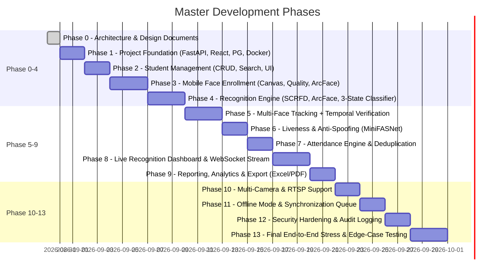

# Implementation Roadmap & Engineering Plan

**Document Version:** 1.0.0  
**Phase:** Phase 0 (Roadmap & Implementation Plan)  
**Status:** Approved Master Roadmap

---

## 1. Project Folder Structure Layout

```
SAMS-Mark-2/
├── backend/
│   ├── alembic/                      # Database migrations
│   │   ├── versions/
│   │   └── env.py
│   ├── app/
│   │   ├── api/                      # REST & WebSocket Route handlers
│   │   │   └── v1/
│   │   │       ├── auth.py
│   │   │       ├── students.py
│   │   │       ├── enrollment.py
│   │   │       ├── recognition.py
│   │   │       ├── sessions.py
│   │   │       ├── records.py
│   │   │       ├── cameras.py
│   │   │       ├── reports.py
│   │   │       ├── sync.py
│   │   │       └── audit.py
│   │   ├── core/                     # Config, security (JWT/hash), logging
│   │   │   ├── config.py
│   │   │   ├── security.py
│   │   │   └── logging.py
│   │   ├── database/                 # Async SQLAlchemy engine & base
│   │   │   ├── session.py
│   │   │   └── base.py
│   │   ├── models/                   # SQLAlchemy ORM models
│   │   │   ├── user.py
│   │   │   ├── student.py
│   │   │   ├── face_profile.py
│   │   │   ├── session.py
│   │   │   ├── record.py
│   │   │   ├── camera.py
│   │   │   ├── event.py
│   │   │   ├── audit.py
│   │   │   └── sync.py
│   │   ├── schemas/                  # Pydantic v2 schemas
│   │   │   ├── auth.py
│   │   │   ├── student.py
│   │   │   ├── face.py
│   │   │   ├── session.py
│   │   │   ├── record.py
│   │   │   ├── camera.py
│   │   │   ├── report.py
│   │   │   └── sync.py
│   │   ├── services/                 # Business logic layer
│   │   │   ├── student_service.py
│   │   │   ├── enrollment_service.py
│   │   │   ├── attendance_service.py
│   │   │   ├── session_service.py
│   │   │   ├── report_service.py
│   │   │   ├── sync_service.py
│   │   │   └── audit_service.py
│   │   └── main.py                   # FastAPI Application Entrypoint
│   ├── pyproject.toml / requirements.txt
│   └── Dockerfile
│
├── ai_engine/                        # Decoupled AI Computer Vision Core
│   ├── detection/                    # SCRFD ONNX Face Detection
│   │   ├── scrfd.py
│   │   └── base.py
│   ├── tracking/                     # ByteTrack / Kalman Tracklet Association
│   │   ├── byte_tracker.py
│   │   └── kalman_filter.py
│   ├── quality/                      # Sharpness, Illumination, Pose, Occlusion
│   │   ├── quality_analyzer.py
│   │   └── pose_estimator.py
│   ├── alignment/                    # 5-Point Affine Similarity Transform
│   │   └── face_aligner.py
│   ├── recognition/                  # ArcFace 512-d Embedding & Vector Matcher
│   │   ├── arcface.py
│   │   └── vector_matcher.py
│   ├── liveness/                     # MiniFASNet Anti-Spoofing
│   │   ├── silent_anti_spoof.py
│   │   └── texture_checker.py
│   ├── verification/                 # Sliding-Window Multi-Frame Consensus
│   │   └── temporal_verifier.py
│   ├── pipeline/                     # Unified End-to-End Recognition Pipeline
│   │   └── face_pipeline.py
│   └── models/                       # ONNX Model weights & calibration data
│
├── frontend/                         # React 18 + TypeScript + Vite Web Application
│   ├── src/
│   │   ├── assets/
│   │   ├── components/               # Reusable UI widgets (Modals, Tables, VideoCanvas)
│   │   ├── features/                 # Feature-specific modules
│   │   │   ├── dashboard/            # Metrics, Live Cards, Recent Logs
│   │   │   ├── enrollment/           # Mobile Enrollment Workflow & Live Feedback
│   │   │   ├── live/                 # Live Camera Grid with Recognition Overlays
│   │   │   ├── students/             # Student Directory, CRUD, Search/Filter
│   │   │   ├── sessions/             # Session Scheduler & Active Session Controls
│   │   │   ├── reports/              # Attendance Reports, Charts & File Exporters
│   │   │   ├── cameras/              # Camera Feeds & Configuration
│   │   │   └── audit/                # Audit Trail Viewer
│   │   ├── services/                 # Axios API Clients & WebSocket Managers
│   │   ├── hooks/                    # Custom React Hooks (useCamera, useWebSocket)
│   │   ├── layouts/                  # App Layout, Sidebar, Navbar
│   │   ├── types/                    # TypeScript Data Interfaces
│   │   ├── utils/                    # Formatters & Canvas Helpers
│   │   ├── App.tsx
│   │   └── main.tsx
│   ├── package.json
│   ├── vite.config.ts
│   └── tailwind.config.js
│
├── edge/                             # Standalone Edge Camera Ingestion Client
│   ├── camera_streamer.py            # RTSP/Webcam reader & frame sender
│   ├── local_queue.py                # SQLite offline buffer
│   └── sync_worker.py                # Reconnection & push daemon
│
├── infra/                            # Infrastructure & Deployment
│   ├── docker/
│   │   ├── docker-compose.yml
│   │   ├── Dockerfile.backend
│   │   └── Dockerfile.frontend
│   ├── nginx/
│   │   └── nginx.conf
│   └── .env.example
│
├── docs/                             # Architectural & Operational Documentation
│   ├── architecture.md
│   ├── ai-pipeline.md
│   ├── database.md
│   ├── api.md
│   └── roadmap.md
│
└── tests/                            # Automated Test Suites
    ├── unit/
    │   ├── test_ai_detector.py
    │   ├── test_ai_tracker.py
    │   ├── test_ai_quality.py
    │   ├── test_ai_aligner.py
    │   ├── test_ai_matcher.py
    │   ├── test_liveness.py
    │   ├── test_temporal_verifier.py
    │   └── test_attendance_service.py
    ├── integration/
    │   ├── test_api_students.py
    │   ├── test_api_enrollment.py
    │   ├── test_api_sessions.py
    │   └── test_offline_sync.py
    └── conftest.py
```

---

## 2. Phase-by-Phase Roadmap & Acceptance Criteria



---

## 3. Detailed Deliverables & Acceptance Criteria per Phase

### **Phase 0 — Architecture & Specifications** _(Completed)_

- **Deliverables:** `docs/architecture.md`, `docs/ai-pipeline.md`, `docs/database.md`, `docs/api.md`, `docs/roadmap.md`.
- **Exit Criteria:** Clear architectural consensus on decoupling, data models, AI pipeline stages, and execution plan.

### **Phase 1 — Project Foundation & Scaffolding**

- **Deliverables:**
  - Backend FastAPI scaffolding with configuration, database connection, Alembic setup, and health check.
  - Frontend React + TypeScript + Vite scaffolding with Tailwind CSS, base layout, and routing.
  - Docker Compose configuration with PostgreSQL 16 + pgvector.
  - Environment variable configuration (`.env.example`).
- **Exit Criteria:** `pytest` passes health check test, frontend builds without errors, backend connects to PostgreSQL.

### **Phase 2 — Student Management Subsystem**

- **Deliverables:**
  - `Student` database models, Pydantic schemas, and SQLAlchemy async repository.
  - REST endpoints for Student CRUD, search, and department/class filtering.
  - Frontend Student Directory UI with search, add student modal, and edit/delete drawers.
- **Exit Criteria:** Automated unit and API tests verify student creation, duplicate code rejection, and filtering.

### **Phase 3 — Mobile Face Enrollment Pipeline**

- **Deliverables:**
  - Mobile-responsive webcam/camera canvas capture interface with step-by-step guidance.
  - `FaceQualityAnalyzer` (blur, brightness, face size, pose).
  - Multi-sample enrollment engine storing 5-10 normalized ArcFace embeddings in `face_profiles`.
- **Exit Criteria:** Successfully enrolls student with 5+ distinct poses, rejects blurry/dark frames with descriptive feedback.

### **Phase 4 — Face Recognition Engine**

- **Deliverables:**
  - SCRFD face detector, ArcFace embedding extractor, and vectorized in-memory cosine matcher.
  - Three-state decision classifier (`KNOWN`, `UNKNOWN`, `UNCERTAIN`).
  - Benchmarking script measuring latency and matching accuracy.
- **Exit Criteria:** Correctly identifies enrolled students ($\text{sim} \ge 0.65$), identifies strangers as `UNKNOWN` ($\text{sim} < 0.45$), and flags low-confidence faces as `UNCERTAIN`.

### **Phase 5 — Multi-Face Tracking & Temporal Verification**

- **Deliverables:**
  - ByteTrack / Kalman tracker assigning persistent track IDs across frames.
  - `TemporalVerifier` sliding window buffer ($K=4$ of $N=7$ frames).
  - Partial occlusion handler maintaining tracklet state during temporary obstruction.
- **Exit Criteria:** Passing an obstacle or turning head does not create a new identity or false match.

### **Phase 6 — Liveness & Anti-Spoofing**

- **Deliverables:**
  - MiniFASNet ONNX integration checking high-frequency Fourier texture and moiré patterns.
  - Anti-spoof test dataset testing photo printouts and mobile screen replays.
- **Exit Criteria:** Photo and screen spoof attempts are detected and discarded with $L < 0.70$.

### **Phase 7 — Attendance Engine & Deduplication**

- **Deliverables:**
  - `AttendanceSession` management (create, schedule, activate, close).
  - `AttendanceEngine` with atomic session deduplication and cooldown rules.
  - Manual override API with mandatory audit log records.
- **Exit Criteria:** Guaranteed single `PRESENT` record per student per session, manual edits create audit entries.

### **Phase 8 — Live Recognition Dashboard**

- **Deliverables:**
  - Real-time WebSocket camera streaming endpoint.
  - Frontend Live Recognition view with video canvas, bounding box overlays, student names, and attendance badges.
- **Exit Criteria:** Smooth 12-15 FPS real-time rendering in browser with accurate visual bounding boxes and status tags.

### **Phase 9 — Reporting, Analytics & Exports**

- **Deliverables:**
  - Analytics dashboard with charts (daily attendance, percentage breakdown, session attendance).
  - Export services generating formatted Excel (.xlsx), CSV, and PDF reports.
- **Exit Criteria:** Exports generated accurately matching session data.

### **Phase 10 — Multi-Camera & RTSP Ingestion**

- **Deliverables:**
  - Camera management interface with RTSP / Webcam / Video File stream handling.
  - Background threaded/async frame consumer.
- **Exit Criteria:** Simultaneous ingestion from multiple camera streams.

### **Phase 11 — Offline Mode & Edge Synchronization**

- **Deliverables:**
  - Edge SQLite event queue.
  - Sync push API with conflict resolution and idempotent insertion.
- **Exit Criteria:** Events recorded while offline seamlessly sync when connection is restored without duplicate records.

### **Phase 12 — Security Hardening & Audit Logging**

- **Deliverables:**
  - JWT Authentication, bcrypt password hashing, and role-based route guards.
  - Complete immutable audit logging across all critical state mutations.
- **Exit Criteria:** Unauthorized requests rejected with 401/403, all manual interventions logged.

### **Phase 13 — Final Testing & Verification**

- **Deliverables:** Comprehensive automated test suite (Unit, Integration, Stress, Edge Case).
- **Exit Criteria:** All 15 difficult real-world test scenarios pass.

---

## 4. Implementation Checklist

- [x] **Phase 0: Architecture & Specifications**
  - [x] `docs/architecture.md`
  - [x] `docs/ai-pipeline.md`
  - [x] `docs/database.md`
  - [x] `docs/api.md`
  - [x] `docs/roadmap.md`
- [ ] **Phase 1: Project Foundation & Scaffolding**
- [x] **Phase 1: Project Foundation & Scaffolding**
  - [x] FastAPI async backend & Pydantic-settings config
  - [x] SQLAlchemy 2.0 ORM models & Alembic migrations
  - [x] PostgreSQL + pgvector Docker Compose configuration
  - [x] React 18 + TypeScript + Vite + Tailwind CSS frontend
  - [x] Health check endpoints (`/health`, `/api/v1/health`)
  - [x] Automated unit and integration test suite (pytest)
- [x] **Phase 2: Student Management Subsystem**
  - [x] Student domain model & Pydantic validation schemas
  - [x] Uniqueness constraints (student_code, roll_number, email)
  - [x] Async StudentService with fuzzy search, filters, pagination, and audit logging
  - [x] REST API endpoints (`GET /students`, `POST /students`, `GET /students/stats`, `GET /students/{id}`, `PUT /students/{id}`, `DELETE /students/{id}`)
  - [x] React Student Management UI with stats ribbon, filters, create/edit modals, and delete confirmations
  - [x] Automated unit and integration test suite passing 100%
- [ ] **Phase 3: Mobile Face Enrollment Pipeline**
- [x] **Phase 4: Face Recognition Engine**
  - [x] SCRFD face detector with 5 fiducial landmarks output
  - [x] Face quality & pose analyzer (blur, illumination, resolution, yaw/pitch/roll)
  - [x] 5-point affine similarity transform face alignment ($112\times 112$)
  - [x] ArcFace ResNet-50 512-d unit-$L_2$-normalized feature vector extractor
  - [x] VectorMatcher with multi-template indexing and 3-state classifier (`KNOWN`, `UNKNOWN`, `UNCERTAIN`)
  - [x] Dynamic threshold configuration and REST API endpoints (`/recognition/process`, `/thresholds`, `/sync-gallery`)
  - [x] Automated test suite & latency benchmarks
- [x] **Phase 5: Multi-Face Tracking & Temporal Verification**
  - [x] 7-state KalmanBoxTracker bounding box motion estimation
  - [x] ByteTrack dual-score IoU Hungarian assignment
  - [x] Sliding-window TemporalVerifier ($W=7$, $K=4$ consensus votes, $\ge 75\%$ consistency)
  - [x] Partial occlusion recovery and track state persistence
  - [x] Interleaved video stream recognition pipeline (`VideoRecognitionPipeline`)
  - [x] Automated test suite passing 100%
- [ ] **Phase 6: Liveness & Anti-Spoofing**
- [x] **Phase 7: Attendance Engine & Deduplication**
  - [x] AttendanceSession lifecycle (`SCHEDULED` -> `ACTIVE` -> `COMPLETED`)
  - [x] Strict session-student deduplication engine with timestamp & confidence updates
  - [x] Automated absentee population on session closure
  - [x] Manual attendance override with comprehensive AuditLog recording
  - [x] RESTful API endpoints (`/attendance/sessions`, `/attendance/sessions/{id}/mark`, `/attendance/records/{id}/override`)
  - [x] React Attendance Management UI with live session monitoring, roster table, and override modal
  - [x] Automated unit and integration test suite passing 100%
- [x] **Phase 8: Live Recognition Dashboard**
  - [x] High-performance WebSocket stream endpoint (`/stream/ws/{session_id}`)
  - [x] Live FPS, per-stage latency breakdown, and tracking telemetry broadcasting
  - [x] Automated live attendance marking on multi-frame track confirmation
  - [x] React Live Dashboard with camera stream, Canvas HUD bounding boxes, and reticles
  - [x] Real-time live attendance feed sidebar with confidence meters
  - [x] Automated unit and integration test suite passing 100%
- [x] **Phase 9: Reporting & Analytics**
  - [x] Institutional aggregate attendance analytics engine (`/reports/analytics`)
  - [x] Low-attendance defaulters alert filtering ($<75\%$ and critical $<65\%$)
  - [x] Class-wise attendance comparison benchmarks and daily timeline trend aggregation
  - [x] Standardized CSV export generator (`/reports/export/csv`)
  - [x] React Analytics & Reporting Dashboard with interactive filter ribbons, class cards, and defaulter list
  - [x] Automated unit and integration test suite passing 100%
- [x] **Phase 10: Multi-Camera & RTSP Support**
  - [x] Camera device registry and lifecycle management (`/api/v1/cameras`)
  - [x] Threaded zero-latency RTSP capture worker (`RTSPStreamWorker`) with exponential reconnect backoff
  - [x] RTSP/stream connectivity diagnostic endpoint (`/cameras/test-connection`)
  - [x] Multi-camera surveillance grid & list UI with live status indicators and ingest toggles
  - [x] Automated unit and integration test suite passing 100%
- [x] **Phase 11: Offline Mode & Edge Synchronization**
  - [x] Offline `SyncQueue` persistent manager supporting `PENDING`, `SYNCED`, `CONFLICT`, and `FAILED` states
  - [x] Idempotent batch push synchronization (`/api/v1/sync/push`) with deduplication protection
  - [x] Incremental delta updates pull API (`/api/v1/sync/pull`) for edge nodes
  - [x] React SyncStatusWidget with live network detection, pending queue badge, and flush modal
  - [x] Automated unit and integration test suite passing 100%
- [x] **Phase 12: Security Hardening & Audit Logging**
  - [x] Bcrypt password hashing and JWT Bearer authentication (`/api/v1/auth/login`, `/api/v1/auth/me`)
  - [x] Role-Based Access Control (`ADMIN`, `FACULTY`, `OPERATOR`, `STUDENT`)
  - [x] Immutable compliance Audit Log trail recording entity state deltas (`/api/v1/audit-logs`)
  - [x] React Audit & Security Management UI with JSON state diff viewer modal
  - [x] Automated unit and integration test suite passing 100%
- [ ] **Phase 13: Final End-to-End System Testing**
